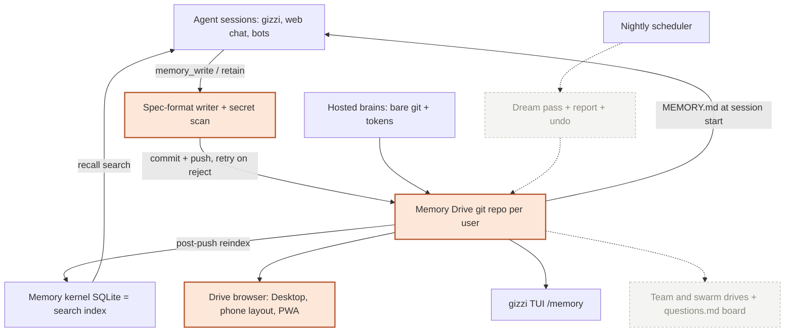

# Memory Drive and nightly Dreaming: git-backed agent memory on every surface

## Goal

Every Allternit user gets a **Memory Drive**: a private git repo of markdown notes that follows the open Agent Memory Repo standard and is the single source of truth for what their agents remember. A short `MEMORY.md` index loads into every session. Each entry is one line with a link to the session it came from. Parallel sessions write safely because git rejects stale pushes.

Each night a **Dream** pass consolidates the drive and lands as one commit with a readable report and one-click undo. The same drive shows up in Desktop, the ai.allternit.com phone layout, the m.allternit.com PWA and gizzi-code. Because the format is standard, users can clone their memory and take it to any agent.

## What Eoj asked

He shared Cognition's three posts (x.com/cognition/status/2107165034463867001, …035780768021, …038188298536): *"we need to implement this in allternit for the platform where it needs to be implemented across all the surfaces."*

Decisions he made on 2026-10-06:
- **The git drive is canonical.** SQLite becomes a search index rebuilt from the drive.
- **Dreaming auto-applies** as one commit plus a report with undo. Twin facts still need the owner's approval, as they do today.
- **Spec first.** Stop at the human gate before any code.

## Verdict

- **Recommendation:** reverse-engineer. We adopt the open file format and memory loop as-is and build our own drive, Dreaming and UI on top of what we already have.
- **Why:**
  - The spec is small (one `SPEC.md`), MIT-licensed, and readable by any agent. Adopting it makes Allternit memory portable and lets external agents (Devin, Claude Code, Codex) read it.
  - We already have most of the parts: hosted per-user git repos (`brain_routes.rs`), a `MEMORY.md` memdir in gizzi, a model-based dream pass (`autoDream`) and a nightly scheduler. What's missing is wiring, the format and UI. No new vendor is needed.
  - It replaces three overlapping cleanup jobs and gives users a visible, undoable history of their memory. Today we have neither.
- **Constraints:** license: yes, MIT (`github.com/AgentMemoryRepo/agentmemoryrepo`, LICENSE read 2026-10-06). Paid/signup: no. Docker: no. Closed source: no; the spec and skill are public. Devin's own implementation is closed, and we copy only the published spec.

## Placement

- **Product area:** `gizzi-code` — Gizzi Code (harness), which owns agent memory per `Research/ROUTING.md` ("agent memory", `platform:services/memory`). The work also touches allternit-api and every workspace surface.
- **Owning Brain doc:** `brain:Products/Gizzi.md`.
- **Code it touches (verified paths):**
  - `platform:cmd/allternit-api/src/brain_routes.rs`: each user gets a reserved `memory` brain repo. Add drive read, history and diff routes, plus a server-side write path with a revision check.
  - `platform:cmd/allternit-api/migrations/V33__brains_and_git_tokens.sql`: an existing brains/tokens schema, reused. A new migration adds the drive pointer and index link columns (number checked at build time).
  - `platform:cmd/allternit-api/src/memory_extraction.rs`: `/memory/v2/retain` writes entries to the drive as commits instead of inserting rows directly.
  - `platform:cmd/allternit-api/src/memory_consolidation.rs`: superseded by Dreaming in Phase 2. In Phase 1 it must not edit rows that come from the drive.
  - `platform:cmd/allternit-api/src/memory_curation.rs`: same as above (Phase 2+).
  - `platform:cmd/allternit-api/src/routine_local_scheduler.rs`: the scheduler the Phase 2 nightly Dream reuses.
  - `platform:cmd/gizzi-code/src/memdir/paths.ts`: memdir becomes a checkout of the drive.
  - `platform:cmd/gizzi-code/src/runtime/tools/builtins/memory-write.ts`: writes spec-format bullets with source links, then commits and pushes, retrying when a push is rejected.
  - `platform:cmd/gizzi-code/src/runtime/memory/kernel-adapter.ts`: the row mirror is replaced; the index is rebuilt from the drive.
  - `platform:cmd/gizzi-code/src/runtime/session/instruction.ts`: loads `MEMORY.md` from the drive at session start.
  - `platform:cmd/gizzi-code/src/cli/ui/ink-app/services/autoDream/consolidationPrompt.ts`: the base for the Phase 2 Dream prompt.
  - `platform:cmd/gizzi-code/src/cli/ui/ink-app/services/teamMemorySync/secretScanner.ts`: reused to block secrets before any commit.
  - `workspace:src/views/settings/MemorySettingsPanel.tsx`: Settings → Memory gains a drive browser (file tree, `MEMORY.md`, history).
  - `workspace:src/fabric-session/phone/screens/SettingsScreen.tsx`: the same drive browser at phone size, for the ai.allternit.com phone layout and the m.allternit.com PWA.
  - `workspace:src/fabric-session/phone/phone.css`: phone styling.
  - `platform:surfaces/docs/core/memory-kernel.mdx`: updated for the new source of truth.
  - `platform:surfaces/docs/api/brain-git.mdx`: documents the drive's clone URL and token use.
  - `platform:surfaces/docs/guides/memory-drive.mdx` (new): the user guide.

## Visual outline



## What already exists

- `platform:cmd/allternit-api/src/brain_routes.rs`: per-user bare git repos over smart-HTTP with `allternit_git_` tokens and a frontmatter page API (works; not used for memory).
- `platform:cmd/gizzi-code/src/cli/commands/brain/sync.ts`: `gizzi brain` init and sync, pull --rebase then push (works; orphaned from memory).
- `platform:cmd/gizzi-code/src/memdir/paths.ts`: a `MEMORY.md` index plus one frontmatter file per memory (works; not versioned, wrong entry shape).
- `platform:cmd/gizzi-code/src/runtime/memory/kernel-adapter.ts`: mirrors memdir writes into kernel rows (works; rows are canonical today).
- `platform:cmd/allternit-api/src/memory_extraction.rs`: model-based add/update/forget on every web turn (works; writes rows only).
- `platform:cmd/allternit-api/src/memory_consolidation.rs`: nightly lexical merge and decay (works; partial, no model, no source checks).
- `platform:cmd/gizzi-code/src/cli/ui/ink-app/services/autoDream/consolidationPrompt.ts`: model dream pass over files and transcripts (partial; off by default, local only).
- `platform:cmd/allternit-api/src/twin_persona.rs`: twin facts with full provenance and owner approval (works; Phase 3 maps it in).
- `workspace:src/views/settings/MemorySettingsPanel.tsx`: fact list, delete, "remember this" (works; rows view, no history).

## What's missing

- No versioned memory: no drive repo per user, no commits, no per-session checkouts, no rejection of stale writes.
- Entries don't follow the spec: there are no one-line bullets with `[source: SESSION_LINK; added: YYYY-MM-DD]` and no `[[path]]` cross-links.
- Web chat, bot and TUI writes go to different stores. Nothing writes to a single file-based truth.
- There is no reindex from files into the kernel (the mirror runs the other way).
- No UI shows memory as files, history or diffs, on any surface.
- There is no clone URL to take memory to another agent.
- There is no single model-based nightly Dream that checks sources, and nothing writes a report or offers undo (Phase 2).
- There is no mounting of several drives, no team drives and no message board (Phase 3).

## Approach

- **The drive.** A reserved brain repo `memory` per user (`BRAINS_DIR/USER_ID/memory.git`), created lazily with `# Memory` and `## Index` in `MEMORY.md`. Desktop's local allternit-api keeps a local bare repo. When signed in, the cloud drive is upstream and Desktop pulls and pushes. Signed out, it stays local, and on first sign-in it is merged up, never overwritten.
- **One writer library** (Rust in allternit-api, TS mirror in gizzi). It parses and writes spec bullets and keeps `MEMORY.md` short (only entries every session needs go above `## Index`). It runs the secret scanner, then makes one commit per edit with message `Remember …` and author `AGENT via Allternit`. On a rejected push it re-reads both versions and writes once (the spec's loop).
- **Source links** use the existing session deep-link route (the executor confirms the exact URL shape; it must open on Desktop, web and phone).
- **Server-side writes.** `retain` and the bot and Thread Inspector "save" actions go through a server checkout of the drive with a revision check. No caller writes memory rows directly anymore.
- **Index.** After every push, a hook reindexes the changed files into `memory_facts`, keyed by `(file, line hash)` through `memory_adapter_links`. `/memory/v2/recall` keeps working unchanged. Rows not in the drive are migrated once.
- **Migration.** A one-time job per user exports kernel facts (and memdir files) into the drive as a single commit, `Import existing memory`, grouped into topic files, with `added` set from row timestamps and `source` where a session id exists. The job is idempotent and has a dry-run mode.
- **gizzi.** The memdir path resolves to a checkout of the drive. `memory_write` and `memory_recall` use the writer. Session start injects `MEMORY.md` and lets the agent grep topic files with its normal tools. The TUI `/memory` shows the drive.
- **UI** (all three surfaces in the same PR). Settings → Memory gains a "Drive" view: file tree, rendered markdown with clickable source links, per-file history with diffs, and a copy-clone-URL button that mints a git token. The phone layout and PWA get the same view in `SettingsScreen`. Use Libraries.dev only where it fits a real state (loading or syncing), with white and `--neutral-fill` surfaces and no tan.
- **Reused open source:** we adopt the Agent Memory Repo `SPEC.md` format (MIT, keep a notice in docs). No code is vendored.

## Phases

- **Phase 1 (the executor's first pass):**
  1. allternit-api: reserved `memory` drive per user, a spec-format writer with secret scan and revision-checked commit, routes for tree, file, history, diff and clone token, a reindex hook into the kernel, and `retain` switched to drive writes. Smoke-boot the real binary on a fresh database. New routes go under `/memory/drive/*`. Check migration numbers against main.
  2. One-time import job (dry run first) from kernel rows and memdir into each drive.
  3. gizzi-code: memdir becomes a drive checkout, `memory_write` writes bullets and commits/pushes with retry, `MEMORY.md` loads at session start, TUI `/memory` shows the drive.
  4. allternit-ai: drive browser in Settings → Memory (Desktop) plus `SettingsScreen` (phone layout and PWA), covering loading, empty, error and signed-out states.
  5. Docs: new `guides/memory-drive.mdx`, updates to `core/memory-kernel.mdx` and `api/brain-git.mdx`, nav updated, `check_links.py` reports 0 problems.
- **Phase 2:** nightly Dream per user. One server job built on the autoDream prompt reads the drive plus that day's session transcripts. It merges duplicates, removes entries that weren't used in N days, settles contradictions by checking sources, and adds lessons from across sessions. It writes one `Dream YYYY-MM-DD` commit plus a report, with one-click undo (a revert commit) on all surfaces. Twin facts are only proposed. It retires `memory_consolidation` and `memory_curation` edits to drive-backed rows.
- **Phase 3:** several drives per session (personal, project/team, bot, swarm), with entries written to the right owner. Bot memory and twin move into drive folders (twin stays proposal-gated). A `questions.md` board lets Factory swarm agents ask and answer.
- **Phase 4:** retire the redundant stores (`memory_notes`, `session_memory`, `beta_memory_*` where unused) once the drive covers them, and publish an Allternit plugin of the open skill for external agents.

## Risks & open questions

- **Risks:**
  - **Prod data migration.** The import must be dry-run first, keep the existing rows and be reversible. Prod migrations are run manually as postgres/SQLite per the runbook.
  - **Write latency.** A git commit on every web turn's `retain` can be slow. Batch it into one commit per turn and keep it off the response path.
  - **Repo growth.** Monitor drive size, and keep transcripts out of the drive (only links go in).
  - **Secrets and PII in memory.** The scanner blocks before commit, and the drive is private per user.
  - **Desktop offline and signed-out merges.** Merge, never force. Surface conflicts in the UI.
  - **Route overlap and migration-number collisions in allternit-api.** A known prod crash cause; smoke-boot before merge.
- **Questions for Eoj:**
  - Should the clone URL (external agents reading your memory) ship in Phase 1, or wait until Phase 2? Recommended: Phase 1, behind a token the user mints.
  - Should old kernel rows stay readable after the import, or be hidden once indexed from the drive? Recommended: keep them for 30 days, then hide.

## Acceptance criteria

- [ ] A new account's first memory write creates `memory.git` with `MEMORY.md` (`# Memory` and `## Index`). The new entry is a one-line bullet with `[source: SESSION_LINK; added: YYYY-MM-DD]`, and `git log` shows one commit for it.
- [ ] Two concurrent gizzi sessions writing different lines both land. Writing the same line, the second push is rejected, it re-reads and writes once, and no entry is lost (automated test).
- [ ] `/memory/v2/recall` returns facts written through the drive within one push. Editing or deleting a line in the drive updates or removes the matching fact.
- [ ] The import job's dry run prints its plan. A real run produces one `Import existing memory` commit per user, and running it again changes nothing.
- [ ] A secret-shaped string (for example `sk-…`) is refused before commit, with a clear message.
- [ ] Settings → Memory on Desktop, the ai.allternit.com phone layout and the m.allternit.com PWA show the file tree, `MEMORY.md`, per-file history and diffs, plus loading, empty, error and signed-out states (screenshots on each surface).
- [ ] `git clone` with a minted token works from a laptop, and an external agent using the open `agent-memory-repo` skill can read the drive.
- [ ] allternit-api boots on a fresh database with the new migration, no route overlap. Existing memory tests pass, and gizzi and allternit-ai type checks and tests pass.
- [ ] Docs updated, nav includes the new guide, and `python3 surfaces/docs/scripts/check_links.py` reports 0 problems.

## Gate checklist

- [x] Client-facing copy? Yes: UI strings and the user guide use voice Register 1 (`company/voice.md`).
- [ ] Money-adjacent (Stripe, invoices, pricing)? No.
- [x] Deploy involved? Yes. ai.allternit.com auto-deploys from main and allternit-api deploys on merge. The m.allternit.com PWA and docs deploys are manual, so preview the command and get Eoj's go-ahead. Prod data migration (the import) needs Eoj's OK and runs dry-run first.
- [ ] Tier C scope? No; this is internal product work, not a client engagement.

## Approval amendment — 2026-10-06

Eoj explicitly approved all four phases in this session: “i want all phases approved and completed in this session /goal”. This supersedes the original Phase 1-only handoff and its non-goals. Clone access ships with a user-minted token; imported rows remain visible for 30 days and are then hidden, never silently destroyed. Production import and deploy commands retain their concrete-preview approval gates. Overlapping rq-20260908-008 and rq-20260908-011 are superseded.

## Executor handoff

```
/goal Ship all four phases of the Memory Drive: per-user git-backed agent memory in the Agent Memory Repo format, canonical over SQLite, on Desktop, ai.allternit.com phone layout, m.allternit.com PWA and gizzi-code, with docs.
Area: gizzi-code · Spec: Research/specs/agent-memory-repo-dreaming.md
First: expand this spec into docs/research-agent-memory-repo-dreaming-PLAN.md (read every path under Placement + What already exists, and the spec at github.com/AgentMemoryRepo/agentmemoryrepo SPEC.md; refine Phase 1 into tasks). Then build and verify all four approved phases, with phase-by-phase review.
Constraints: no paid/signup/Docker; git drive is canonical, SQLite is a rebuilt index; never force-push; secret scan before every commit; source = session link, added = YYYY-MM-DD; reuse brain_routes.rs hosted git + autoDream prompt, no new store; new routes under /memory/drive/*; smoke-boot allternit-api on a fresh db before merge; work in worktrees, not the shared checkout; all three UI surfaces + docs in the same PR set; no deploy, PWA deploy, or prod import without Eoj's go-ahead; Register 1 copy; white + --neutral-fill surfaces.
Acceptance: copy the Acceptance criteria section.
Approved scope: nightly Dream + undo (Phase 2), multi-drive mounting, team/swarm drives, questions.md board, bot/twin migration (Phase 3), store retirement + external plugin (Phase 4). Keep twin owner approval and reversible migration safeguards.
```

## Executor model tier

- Task class: `architecture_or_novel_judgment` (it changes the source of truth across the API, runtime and three UI surfaces, and includes a prod data migration).
- Model tier: A://Fe → `claude-fable-5` (agent alias `fable`), read from `Ops/model-routing.json` on 2026-10-06 because the `model_route` MCP server failed to connect this session. Re-check with `model_route` before spawning.
