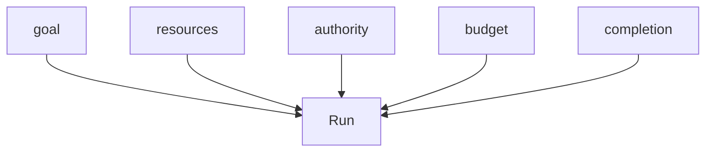
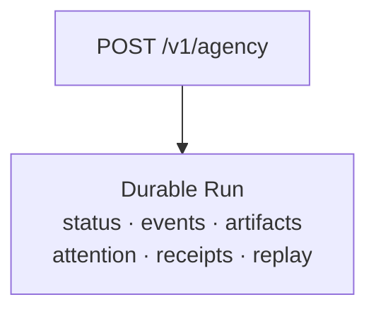

<Warning>
**PREVIEW.** The Agency API is not live yet. This page describes the published v0.3 contract so you can review and build against it; details may change before alpha. Implementation status: DESIGN — NOT YET IMPLEMENTED.
</Warning>

## What it is

The Agency API is the public developer surface for the Allternit agent kernel. You send a goal. The service compiles it into explicit internal contracts (a task, agent state, a compute graph, policy, verification) and returns one durable **Run** that you can stream, steer, pause, cancel, audit and replay.

The contract summary is: goal in, one durable verified Run out.





Only `goal` is required. Everything else has a resolved, recorded default. What comes back is one durable object you can observe and control for the life of the work.

### Availability

No endpoint on this page is live. The alpha opens only after one end-to-end run can survive **restart, resume, verify, replay and receipt-backed completion**. That gate is not met today: the public endpoint and the request compiler are not served, the conformance suite is not built, and no end-to-end bug-fix run has passed the gate. Inside the kernel, the signed receipt chain (effect receipts) and recorded-only replay are on main, internal only, and work-runtime runs have no public event stream yet. See [what is live today](/architecture#what-is-live-today).

Use this reference to understand the shape of the API and to plan an integration. Do not build production systems against it yet.

<Note>
Example values throughout this reference (IDs, capability and model class names, amounts, dates, default values) are illustrative. The structure and field names follow the contract.
</Note>

## Agents API vs Agency API

**An Agent is configuration and identity. Agency is execution of work.**

| API | What it is for |
|-----|----------------|
| [Agents API](/api/agents) | Configure persistent agent identities and profiles: instructions, capabilities, policies, a default model preference. |
| [Agency API](/api/agency/overview) | Submit durable autonomous work: a goal becomes one verified Run. **PREVIEW.** |
| [Runs](/api/agency/runs) | Observe and control execution: stream, steer, pause, cancel, audit. **PREVIEW.** |
| [Decisions](/api/agency/decisions) | Make a bounded, typed decision with no side effects. **PREVIEW.** |

## Simple outside, explicit inside

The request can be small because the server makes everything explicit before it runs anything.

- **Only `goal` is required.** Workspace, authority, budget and completion are optional.
- **Defaults are resolved, recorded and returned.** Whatever you omit is filled from the agent's and profile's versioned defaults and returned on `Run.resolved` before execution starts. The run stays `accepted` until that is recorded.
- **No hidden permissive defaults.** If a safe default cannot be resolved, the call fails with `422 ERR_DEFAULTS_UNRESOLVABLE` and no run executes.
- **No implicit loop.** The service never runs a free-form agent loop. It compiles the request into contracts and executes those.
- **Kernel internals stay out of the default view.** Which model, decision backend, graph branch, tool schema, cache or verifier ran is recorded in receipts and shown with `view=debug`. None of it is a required field or part of a default response.
- **No model or vendor names.** Models are interchangeable components. You constrain by capability, model class, locality and trust class.

Two enforcement settings are always on for runs created here and cannot be disabled by a client: the judge fails closed, and completion is owned by the verifier. They are reported on `Run.resolved.enforcement`.

## Progressive disclosure

The API has four tiers. Most integrations only need the first.

| Tier | Name | What you control | Where |
|------|------|------------------|-------|
| A | Goal API | `goal`, and optionally `workspace`, `authority`, `budget`, `completion` | [`POST /v1/agency`](/api/agency/runs#create-a-run) |
| B | Capability API | `capabilities` allow and deny lists; `models` by class, locality and trust class | [`GET /v1/capabilities`](/api/agency/catalog#list-capabilities), [`GET /v1/models`](/api/agency/catalog#list-model-classes) |
| C | Graph API | `graph` template or graph IR; inspect the compiled graph. Requires scope `graph:read` to inspect | [`GET /v1/runs/{run_id}/graph`](/api/agency/runs#get-the-compiled-graph) |
| D | Runtime API | `runtime` hints (deployment profile, minimum readout level, cassette recording) and replay overrides | [`POST /v1/replays`](/api/agency/replays) |

Tier C and D fields are marked `x-disclosure-tier` in the OpenAPI file. Runtime hints never change semantics, eligibility, policy or evidence. Graph input is treated as opaque until the public Graph contract is frozen.

## Object model

| Object | What it is | Reference |
|--------|-----------|-----------|
| **Agent** | A logical composite agent identity, for example `allternit-code@v1` | [Catalog](/api/agency/catalog#list-agents) |
| **Run** | A durable execution instance for one goal | [Runs](/api/agency/runs) |
| **Event** | A typed, ordered, durable record of something that happened in a run | [Events](/api/agency/events) |
| **Attention request** | A request for human input or review | [Attention](/api/agency/attention) |
| **Artifact** | An immutable, content-addressed output of a run | [Artifacts](/api/agency/artifacts) |
| **Receipt** | Hash-chained, signed evidence of effects, inputs, policy and verification | [Receipts](/api/agency/receipts) |
| **Campaign** | A persistent objective that creates and drives runs over time | [Campaigns](/api/agency/campaigns) |
| **Replay** | A re-run of a finished run from recorded results, with no effects | [Replays](/api/agency/replays) |
| **Decision** | An optional low-level decision call with no side effects | [Decisions](/api/agency/decisions) |
| **Capability** | A stable semantic ability (`cap.*`), independent of backend | [Catalog](/api/agency/catalog#list-capabilities) |
| **Model class** | A logical class by locality and trust (`mc.*`), never a model name | [Catalog](/api/agency/catalog#list-model-classes) |
| **Authority profile** | A named, versioned bundle of scoped grants | [Catalog](/api/agency/catalog#list-authority-profiles) |
| **Completion criterion** | A versioned registry entry that defines what a pass means | [Catalog](/api/agency/catalog#list-completion-criteria) |
| **Graph** | The compiled graph of a run (tier C) | [Runs](/api/agency/runs#get-the-compiled-graph) |

There is no Thread API. `thread_id` is a correlation ID only, and messages arrive as `run.message` events.

## Base URL

```text
https://api.allternit.com
```

This is the planned production endpoint. It does not serve these routes yet. The major version is in the path (`/v1`).

## Authentication

Send an API key as a bearer token. Keys are scoped to one workspace or organization.

```bash
Authorization: Bearer $ALLTERNIT_API_KEY
```

OAuth 2.0 client credentials is planned for machine-to-machine clients, with these scopes:

| Scope | Allows |
|-------|--------|
| `runs:write` | Create and control runs, answer attention |
| `runs:read` | Read runs, events, artifacts |
| `receipts:read` | Read receipts and chain verification |
| `campaigns:write` | Create and control campaigns |
| `campaigns:read` | Read campaigns |
| `replays:write` | Create replays |
| `decisions:write` | Call the decision surface |
| `catalog:read` | Read agents, capabilities, model classes, profiles |
| `graph:read` | Tier C graph inspection |
| `debug:read` | `view=debug` on any resource |

`GET /.well-known/jwks.json` needs no authentication. It serves the public keys used to verify receipts.

## Common headers

### Request

| Header | Required | Description |
|--------|----------|-------------|
| `Authorization` | yes | `Bearer <api key>` |
| `Idempotency-Key` | on every effectful `POST` | 8 to 255 characters. See [Idempotency](/api/agency/idempotency). |
| `Allternit-Version` | no | Dated API version, `YYYY-MM-DD`. Defaults to the version pinned to the key. See [Versioning](/api/agency/versioning). |
| `Accept` | no | `text/event-stream` to stream events; `application/json` otherwise. |
| `Last-Event-ID` | no | Resume point for the event stream. See [Events](/api/agency/events#resume). |

### Response

| Header | Description |
|--------|-------------|
| `Allternit-Version` | The dated version that served the request. |
| `Allternit-Request-Id` | Request identifier. Include it when reporting a problem. |
| `Location` | URL of the resource created by a `202` response. |
| `ETag` | Weak ETag of the run's durable state version. |
| `Idempotency-Replayed` | `true` when the response is a stored replay of an earlier request with the same key. |
| `Deprecation` | RFC 9745 deprecation date, if the resource or behavior is deprecated. |
| `Sunset` | RFC 8594 removal date, if scheduled. |
| `Retry-After` | Seconds to wait, on `429` and some `5XX` responses. |

## Pagination

Every list endpoint is cursor-paginated.

| Query parameter | Type | Description |
|-----------------|------|-------------|
| `cursor` | string | Opaque cursor from a previous page's `next_cursor`. |
| `limit` | integer | 1 to 200. Default 50. |

Every list response has this envelope:

```json
{
  "object": "list",
  "data": [],
  "has_more": false,
  "next_cursor": null
}
```

## The minimal call

The smallest valid request has one field.

```bash
curl -X POST https://api.allternit.com/v1/agency \
  -H "Authorization: Bearer $ALLTERNIT_API_KEY" \
  -H "Idempotency-Key: 3f1c2a9e-7b1d-4c55-9a0e-1d2b3c4d5e6f" \
  -H "Allternit-Version: 2026-09-29" \
  -H "Content-Type: application/json" \
  -d '{"goal": "Fix the failing checkout tests and verify the repair"}'
```

The service persists the run and returns `202 Accepted` with the Run. Everything the server resolved for you is in `resolved`.

```http
HTTP/1.1 202 Accepted
Location: /v1/runs/run_01JB2K4Y7MQ8
Allternit-Version: 2026-09-29
Allternit-Request-Id: req_8f2c1d
Content-Type: application/json
```

```json
{
  "id": "run_01JB2K4Y7MQ8",
  "object": "run",
  "status": "accepted",
  "status_reason": null,
  "terminal": false,
  "agent": "allternit-code@v1",
  "thread_id": "thr_01JB2K4Y7N",
  "campaign_id": null,
  "goal": "Fix the failing checkout tests and verify the repair",
  "created_at": "2026-09-29T17:00:00Z",
  "updated_at": "2026-09-29T17:00:00Z",
  "finished_at": null,
  "version": 1,
  "budget": { "max_seconds": 900, "max_cost_usd": 2.0, "on_exhaustion": "request_attention" },
  "budget_usage": { "seconds": 0, "cost_usd": 0, "steps": 0, "spend_halted": false },
  "attention": null,
  "open_attention_count": 0,
  "completion": {
    "status": "pending",
    "criteria": [
      { "criterion": "tests_pass", "result": "pending", "receipt_ids": [] },
      { "criterion": "no_new_regressions", "result": "pending", "receipt_ids": [] }
    ]
  },
  "output": null,
  "cancellation": null,
  "error": null,
  "links": {
    "self": "/v1/runs/run_01JB2K4Y7MQ8",
    "events": "/v1/runs/run_01JB2K4Y7MQ8/events",
    "artifacts": "/v1/runs/run_01JB2K4Y7MQ8/artifacts",
    "receipts": "/v1/runs/run_01JB2K4Y7MQ8/receipts",
    "attention": "/v1/runs/run_01JB2K4Y7MQ8/attention"
  },
  "metadata": {},
  "resolved": {
    "workspace": { "repo": "repo://acme/store" },
    "authority": {
      "profile": { "id": "code-safe", "version": 1 },
      "grants_summary": {
        "capabilities": ["cap.code.read", "cap.code.edit", "cap.test.run"],
        "filesystem_scope": {
          "read": "workspace",
          "write": "workspace_paths_declared_writable",
          "execute": "sandboxed_workspace",
          "outside_workspace": "deny"
        },
        "network": {
          "default": "deny",
          "private_ip": "deny",
          "max_redirects": 3,
          "redirect_scope": "allowlist",
          "dns_rebind": "pin_resolution",
          "defaults_version": "2026-09-29"
        },
        "approval_requirements": [
          { "effect": "write", "mode": "ask_unless_granted" },
          { "effect": "network", "mode": "always_ask" },
          { "effect": "irreversible", "mode": "never_allowed" }
        ],
        "grant_count": 3
      },
      "interaction_mode": "approval_gated",
      "expires_at": null
    },
    "budget": { "max_seconds": 900, "max_cost_usd": 2.0, "on_exhaustion": "request_attention" },
    "completion": {
      "contract_id": "cc_01JB2K4Y7P",
      "contract_version": 1,
      "require": [
        { "id": "tests_pass", "version": 1 },
        { "id": "no_new_regressions", "version": 1 }
      ],
      "allow_partial": false
    },
    "defaults_source": "agent:allternit-code@v1/profile:code-safe@1",
    "defaults_version": "2026-09-29",
    "enforcement": { "judge_fail_closed": true, "verifier_owned_completion": true },
    "resolved_at": "2026-09-29T17:00:00Z"
  },
  "effect_receipt_ids": []
}
```

The fully explicit equivalent of the same request:

```json
{
  "agent": "allternit-code",
  "goal": "Fix the failing checkout tests and verify the repair",
  "workspace": { "repo": "repo://acme/store" },
  "authority": { "profile": "code-safe" },
  "budget": { "max_seconds": 900, "max_cost_usd": 2.0 },
  "completion": { "require": ["tests_pass", "no_new_regressions"] },
  "stream": true
}
```

When you supply all four, `resolved.defaults_source` is `request`. Supplying a field overrides the default. It never widens authority beyond your entitlement or hard policy.

## Endpoints

| Method | Path | Description | Page |
|--------|------|-------------|------|
| `POST` | `/v1/agency` | Start one durable run from a goal | [Runs](/api/agency/runs#create-a-run) |
| `GET` | `/v1/runs` | List runs | [Runs](/api/agency/runs#list-runs) |
| `GET` | `/v1/runs/{run_id}` | Get a run | [Runs](/api/agency/runs#get-a-run) |
| `POST` | `/v1/runs/{run_id}/input` | Answer, steer or add data | [Runs](/api/agency/runs#submit-input) |
| `POST` | `/v1/runs/{run_id}/pause` | Pause a run | [Runs](/api/agency/runs#pause-a-run) |
| `POST` | `/v1/runs/{run_id}/resume` | Resume a run | [Runs](/api/agency/runs#resume-a-run) |
| `POST` | `/v1/runs/{run_id}/cancel` | Cancel a run | [Runs](/api/agency/runs#cancel-a-run) |
| `GET` | `/v1/runs/{run_id}/graph` | Inspect the compiled graph (tier C) | [Runs](/api/agency/runs#get-the-compiled-graph) |
| `GET` | `/v1/runs/{run_id}/events` | Event stream (SSE) or event page | [Events](/api/agency/events) |
| `GET` | `/v1/runs/{run_id}/attention` | Attention requests for a run | [Attention](/api/agency/attention#list-attention-for-a-run) |
| `GET` | `/v1/attention` | Needs-you queue across runs and campaigns | [Attention](/api/agency/attention#list-attention) |
| `GET` | `/v1/attention/{attention_id}` | Get one attention request | [Attention](/api/agency/attention#get-an-attention-request) |
| `POST` | `/v1/attention/{attention_id}/responses` | Respond to an attention request | [Attention](/api/agency/attention#respond-to-an-attention-request) |
| `GET` | `/v1/runs/{run_id}/artifacts` | List a run's artifacts | [Artifacts](/api/agency/artifacts#list-artifacts) |
| `GET` | `/v1/runs/{run_id}/artifacts/{artifact_id}` | Get one artifact | [Artifacts](/api/agency/artifacts#get-an-artifact) |
| `GET` | `/v1/runs/{run_id}/receipts` | List a run's receipt chain | [Receipts](/api/agency/receipts#list-receipts) |
| `GET` | `/v1/runs/{run_id}/receipts/verification` | Server-side chain check | [Receipts](/api/agency/receipts#verify-a-receipt-chain) |
| `GET` | `/v1/receipts/{receipt_id}` | Get one receipt | [Receipts](/api/agency/receipts#get-a-receipt) |
| `GET` | `/.well-known/jwks.json` | Receipt verification keys | [Receipts](/api/agency/receipts#get-verification-keys) |
| `POST` | `/v1/campaigns` | Create a campaign | [Campaigns](/api/agency/campaigns#create-a-campaign) |
| `GET` | `/v1/campaigns` | List campaigns | [Campaigns](/api/agency/campaigns#list-campaigns) |
| `GET` | `/v1/campaigns/{campaign_id}` | Get a campaign | [Campaigns](/api/agency/campaigns#get-a-campaign) |
| `GET` | `/v1/campaigns/{campaign_id}/runs` | List a campaign's runs | [Campaigns](/api/agency/campaigns#list-campaign-runs) |
| `POST` | `/v1/campaigns/{campaign_id}/pause` | Pause a campaign | [Campaigns](/api/agency/campaigns#pause-a-campaign) |
| `POST` | `/v1/campaigns/{campaign_id}/resume` | Resume a campaign | [Campaigns](/api/agency/campaigns#resume-a-campaign) |
| `POST` | `/v1/campaigns/{campaign_id}/cancel` | Cancel a campaign | [Campaigns](/api/agency/campaigns#cancel-a-campaign) |
| `POST` | `/v1/replays` | Create a replay | [Replays](/api/agency/replays#create-a-replay) |
| `GET` | `/v1/replays/{replay_id}` | Get a replay | [Replays](/api/agency/replays#get-a-replay) |
| `GET` | `/v1/replays/{replay_id}/results` | Get the divergence report | [Replays](/api/agency/replays#get-replay-results) |
| `POST` | `/v1/decisions` | Make a bounded decision | [Decisions](/api/agency/decisions) |
| `GET` | `/v1/capabilities` | List capabilities | [Catalog](/api/agency/catalog#list-capabilities) |
| `GET` | `/v1/agents` | List agents | [Catalog](/api/agency/catalog#list-agents) |
| `GET` | `/v1/models` | List model classes | [Catalog](/api/agency/catalog#list-model-classes) |
| `GET` | `/v1/authority-profiles` | List authority profiles | [Catalog](/api/agency/catalog#list-authority-profiles) |
| `GET` | `/v1/completion-criteria` | List completion criteria | [Catalog](/api/agency/catalog#list-completion-criteria) |

## Product laws

These hold for every call.

1. The API is not the kernel. HTTP, an SDK or local IPC may all drive the same kernel.
2. The request may be simple only because the server compiles it into explicit internal contracts.
3. The external agent identity does not reveal internal components unless you ask for debug or receipt views.
4. Models cannot own permission, lifecycle, completion, durable truth or policy.
5. No unattended executor may bypass policy because its own harness is in a yolo or auto-approve mode.
6. Hard policy comes before probabilistic judgment. Probabilistic systems may raise friction but cannot weaken a hard deny.
7. Completion is owned by the verifier and the system, not by the model that did the work.
8. Effectful retries require idempotency receipts.
9. Run state survives model eviction, cache loss, executor death and process restart.
10. Every material transition is observable through typed events and receipts.
11. No model or vendor names in the contract.
12. Judge failure fails closed: a timeout, missing calibration or low confidence becomes an ask, never an allow.
13. Agents request attention. They never notify people directly.
14. Replays never cause effects.
15. Untrusted input stays fenced and is never concatenated into control instructions.
16. Grants are explicit, scoped and expire with the run.
17. Receipts are append-only.

## OpenAPI file

The full contract is available as an OpenAPI 3.1 file:

<Card title="Download openapi-v0.3.yaml" icon="download" href="/api/agency/openapi-v0.3.yaml">
  Allternit Agency API v0.3 (preview contract)
</Card>

## Next

- [Quickstart](/api/agency/quickstart)
- [Runs](/api/agency/runs)
- [Errors](/api/agency/errors)
- [Schemas](/api/agency/schemas)
- Concepts: [Living Agent Architecture](/architecture), [The kernel](/architecture/kernel)
