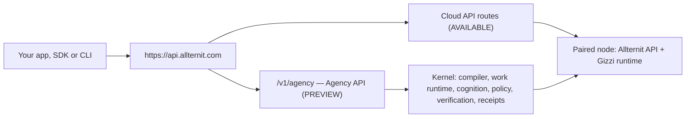
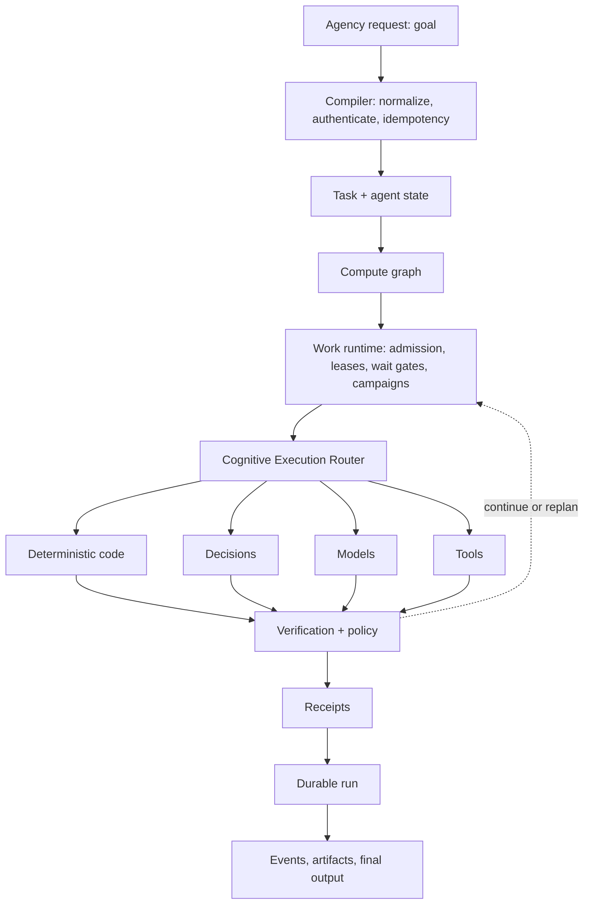

## Kernel and Agency API

Two names appear throughout these docs. They are different things:

- **The kernel** is the system that runs agent work: it compiles a goal into typed contracts, carries the run durably, enforces policy, verifies results and writes receipts. See [The kernel](/architecture/kernel).
- **The Agency API** is the public HTTP surface over the kernel: send a goal, get one durable, verified run. It is **PREVIEW**: the [v0.3 contract](/api/agency/overview) is published and the endpoint is not served yet.

There is one public origin, `https://api.allternit.com`. `/v1/agency` is a new surface of the existing [Cloud API](/api/overview), not a separate service.



The detailed path of one request inside the kernel is in [Request path](#request-path).

## Status labels

Every page and feature in the architecture docs carries one of these labels.

| Label | Meaning |
|-------|---------|
| **AVAILABLE** | On main and enabled by default. You can use it today. |
| **PREVIEW** | Published for review or opt-in only. It may change, and it is not on by default. |
| **DESIGN — NOT YET IMPLEMENTED** | Specified and designed. No working implementation yet. |
| **RESEARCH** | Being investigated. No committed design. |

## The invariant

Allternit does not use a model to simulate an agent. Allternit implements the agent as a system and uses models as interchangeable cognitive components.

In practice this means the parts of an agent that must be dependable are owned by the system, not by a model:

- **State** lives in typed, versioned records, not in a transcript.
- **Authority** comes from explicit, scoped grants checked by policy, not from a prompt.
- **Lifecycle** (start, wait, resume, cancel, finish) is driven by a work runtime, not by a model loop.
- **Completion** is decided by the system from verification evidence, not by a model saying it is done.

There is a test for this. If swapping one model for another changes the agent loop, the state model, tool authority, completion semantics or the workflow graph, the implementation does not conform to the architecture.

<Note>
This page describes both the design and the current state of the build. Each section says which is which, and the [status table](#what-is-live-today) at the end lists what runs today and what does not.
</Note>

## Two machines

The agent is two machines that share a policy layer and a compute fabric.

| Machine | What it does | Main parts |
|---------|--------------|------------|
| **Cognitive Machine** | Decides and produces. Picks the cheapest correct form of inference for each step. | S0–S3 cognition levels, decision runtime, context compiler, Cognitive Execution Router, model pool, verification |
| **Work Machine** | Makes work durable. Carries a run across time, processes and restarts. | Compute graph lifecycle, node outputs and receipts, leases and heartbeats, admission and spawn caps, wait gates, campaigns, wake and attention |

Both run on top of policy (what is allowed) and the fabric (where compute runs). A model is one component inside the Cognitive Machine. It is not the agent.

## Request path

This is the designed path of one request through the system. The Agency API entry point and the router are not built yet; see [what is live today](#what-is-live-today).



A caller sends a goal. The compiler turns it into explicit internal contracts: a task, an agent state record and a compute graph. The work runtime admits and leases each graph node. The router picks how each node is executed. Every result is verified and checked against policy, and every effect, input and verdict is written as a receipt. The run is durable the whole way through, and callers observe it as typed events.

## The eight planes

Each responsibility in the system has one owner. The architecture groups owners into eight planes.

| # | Plane | Owns |
|---|-------|------|
| 1 | Experience / API | The single external agent identity, API and SDK surface, event streams, artifacts. The [Agency API](/api/agency/overview) lives here. |
| 2 | Agent | The task record, agent state, the agent instruction set and capability semantics. |
| 3 | Work Orchestration | The compute graph, node lifecycle, node outputs, leases, heartbeat and reclaim, admission, campaigns, wait and wake, idempotency, replay hooks. |
| 4 | Cognition | The S0–S3 levels, the decision runtime, the judge runtime and verification cognition. |
| 5 | Context + State | The context compiler, chunk store, memory, and cognitive state. |
| 6 | Execution / Model | The Cognitive Execution Router, the model pool, tool runtimes and fabric placement. |
| 7 | Governance + Observability | Policy, receipts, replay, evaluations, provenance and budgets. |
| 8 | Product Operations | Attention, human approvals, channels, remote control, quiet hours and caps, pause, resume and kill, the needs-you queue, audit views. This plane is not a second agent runtime. |

## Cognition levels S0–S3

Each graph node is assigned one cognition level. The levels are roles within one agent, not separate agents.

| Level | What it is | Output | Limits |
|-------|-----------|--------|--------|
| **S0** | Exact deterministic computation, policy checks and tool execution | A typed fact or a receipt | None beyond the code itself |
| **S1** | A bounded probabilistic decision over known candidates | A decision with a confidence | Owns no authority, no free-form reasoning, no durable state and no side effects |
| **S2** | Bounded generation | A candidate artifact | Output is a candidate, never truth, until verified |
| **S3** | Deep escalation: a larger solver, an ensemble, a specialist or a human | A candidate or an answer | Selected by policy and routing, never by a weaker model judging itself. A human route always goes through an attention request |

The rule for choosing is to pick the cheapest correct form of inference before picking a model:

1. Deterministic code, when the answer can be computed (S0).
2. Candidate scoring, when every legal answer is known in advance (S1).
3. Structured decoding, when the shape is known but the values are not (S2 with a grammar).
4. Free generation, when none of the above fit (S2 or S3).

Every transition records its evidence, state version, capability, confidence and verification status.

## Design laws

| # | Law | Plain meaning |
|---|-----|---------------|
| 1 | No implicit agency | Nothing acts unless an explicit contract (a graph node, a grant) says it may. There is no free-form loop. |
| 2 | State before prose | Truth is typed state. Text a model wrote is not the record. |
| 3 | Select before generate | If the legal answers are known, choose among them instead of generating text. |
| 4 | Candidate, not truth | Model output is a candidate until a verifier passes it. |
| 5 | One external identity | Callers see one logical agent. Which internal components ran is execution evidence, shown only in receipts and debug views. |
| 6 | Contracts, never model names | Contracts name capabilities, classes, locality and trust. No contract names a model or vendor. |
| 7 | Policy outranks probability | A hard policy deny is never overridden by a probabilistic judgment. |
| 8 | Graceful degradation | When a component is missing or slow, the system falls back to a safer path instead of failing open. |
| 9 | Measure system lift | Evaluate the whole system on the task, not a model in isolation. |
| 10 | Hardware independence | The contracts do not assume a particular machine size or accelerator. |

Four further rules follow from these and are covered on their own pages:

- Models cannot own permission, lifecycle, completion, durable truth or policy. See [Policy and safety](/architecture/policy).
- Completion is owned by the verifier and the system. See [Verification](/architecture/verification).
- Effectful retries need idempotency keys and receipts. Run state survives model eviction, cache loss, executor death and process restart. See [Receipts](/architecture/receipts).
- The contracts between all of these parts are frozen and versioned. See [Kernel contracts](/architecture/kernel-contracts).

## How today's pieces map

The architecture is a target that the existing product is being moved onto. These are the parts you can use now and where they sit.

| Piece | Role in the architecture | Docs |
|-------|--------------------------|------|
| **Gizzi Code** | The agent runtime and CLI. It executes work: sessions, tools, sandboxing, model calls. | [Gizzi runtime](/core/gizzi-runtime), [CLI](/cli/overview) |
| **CommRails** | The work runtime (Work Orchestration plane). It carries work as a graph of nodes with outputs, wait gates, leases and campaigns. | [CommRails](/core/commrails) |
| **Permission floor** | The start of the Governance plane. Hard policy runs first and no executor's native bypass mode is honored. | [Policy and safety](/architecture/policy) |
| **Kernel ABI 1.0.0** | The frozen contract package that every plane is built against. | [Kernel contracts](/architecture/kernel-contracts) |
| **Surfaces** | The Experience plane today: desktop, web, mobile, extensions. | [Desktop](/surfaces/desktop), [Platform](/surfaces/platform) |

### One Brain, Many Faces

Earlier docs described Allternit as "One Brain, Many Faces". That description still holds and maps onto the planes above. The Brain is the runtime system, never a model; see [Agents](/architecture/agents).

- **The Brain (Gizzi)** is the runtime that manages agent lifecycle, code execution and sandboxing, model interaction, state and event coordination. In the architecture it spans the Agent, Cognition and Execution planes.
- **The Faces (Surfaces)** are the user-facing interfaces. They belong to the Experience plane and hold no agent logic of their own.
- **The Nervous System (SDK and communication layer)** connects surfaces to the runtime. See the [TypeScript SDK](/sdk/typescript), [Communication](/core/communication) and [Git DAG](/core/git-dag).

<CardGroup cols={3}>
  <Card title="Desktop App" icon="desktop" href="/surfaces/desktop">
    Packaged Electron app. Loads the platform, manages local VMs and global hotkeys.
  </Card>
  <Card title="Platform" icon="browser" href="/surfaces/platform">
    Web shell for chat, code, workspace, design and Agent Hub.
  </Card>
  <Card title="Extensions" icon="puzzle" href="/surfaces/extensions">
    Browser extension for browser automation, plus Office add-ins.
  </Card>
</CardGroup>

## What is live today

| Part | Status | Notes |
|------|--------|-------|
| Gizzi Code runtime and CLI | **AVAILABLE** | See [CLI overview](/cli/overview). |
| Work runtime: node outputs | **AVAILABLE** | Outputs are first-class and consumed by reference. |
| Work runtime: wait gates | **AVAILABLE** | Manual and timer gates on graph nodes. |
| Work runtime: leases and reclaim | **AVAILABLE** | Heartbeat plus reclaim of stale leases. |
| Campaigns in the work runtime | **AVAILABLE** | Scheduled waking through the Agency API stays off until an explicit go-live. |
| Attention gate | **AVAILABLE** | Agents request attention; they do not notify people directly. |
| Permission floor | **AVAILABLE** | Hard policy before probabilistic judgment; no bypass through an executor's native mode. |
| Kernel ABI 1.0.0 contracts | **AVAILABLE** | Frozen contract package, registry and schema tests. See [Kernel contracts](/architecture/kernel-contracts). |
| Fail-closed judge and verifier-owned close | **PREVIEW** | Opt-in for internal flows; not on by default. Designed to be always on for Agency API runs. |
| Agency API (`/v1/agency`) | **PREVIEW** | The v0.3 contract is published as a [preview reference](/api/agency/overview). The endpoint is not served. |
| Cognitive Execution Router and model pool | **DESIGN — NOT YET IMPLEMENTED** | |
| Replay and cassette recording | **DESIGN — NOT YET IMPLEMENTED** | See [Replay](/architecture/replay). |
| Signed receipt chain | **DESIGN — NOT YET IMPLEMENTED** | Receipts exist as content hashes today. See [Receipts](/architecture/receipts). |
| Runtime conformance suite | **DESIGN — NOT YET IMPLEMENTED** | Only contract-level schema tests exist. |
| Cross-component cache and state transfer | **RESEARCH** | Contracts reserve the shape; no committed design for the mechanism. |

The Agency API opens for alpha only after one end-to-end run can survive restart, resume, verify, replay and receipt-backed completion. That gate is not met.

## Production topology

This section describes how the product is deployed today. It is independent of the architecture above.

There is **one public API**. The Cloud API is the control plane. Allternit API is the data plane and is never a public hostname.

```
Browser / SDK / CLI  →  https://api.allternit.com  (Cloud API, Postgres)
                              │
                              │ outbound WebSocket relay
                              ▼
                     Allternit API :8013 (SQLite, not public)
                              │
                              ▼
                     Gizzi runtime (local to the node)
```

| Plane | Binary | Origin | Database |
|-------|--------|--------|----------|
| Control | `allternit-cloud-api` | `https://api.allternit.com` | Postgres |
| Data | `allternit-api` | loopback / tailnet `:8013` | Per-instance SQLite |

Node-affine routes (agent sessions, Office, beta research) are Cloud API handlers that **relay** to the caller's default healthy node. No healthy node → HTTP 428.

Full split: [API Overview](/api/overview).

## Deployment models

<AccordionGroup>
  <Accordion title="Local desktop">
    Allternit Desktop runs Allternit API and Gizzi on the user's machine and pairs the node to the account. Best for day-to-day work on a laptop.
  </Accordion>

  <Accordion title="User-paired (BYOC)">
    Install Allternit API on a VPS or homelab you own. Approve a pairing code. The node opens an outbound relay — no inbound ports. Best for data residency and existing infrastructure.
  </Accordion>

  <Accordion title="Allternit-provisioned">
    Cloud API creates an isolated instance per subscription. Init installs Allternit API and auto-pairs. Best for teams that want a hosted data plane without running a box.
  </Accordion>
</AccordionGroup>

See [BYOC Overview](/byoc/overview).

## Next

<CardGroup cols={2}>
  <Card title="Agents" icon="user-gear" href="/architecture/agents">
    What an agent is, and why a model is never the brain.
  </Card>
  <Card title="The kernel" icon="microchip" href="/architecture/kernel">
    The durable run, its statuses, attention and budgets.
  </Card>
  <Card title="Policy and safety" icon="shield" href="/architecture/policy">
    The policy floor, authority profiles and the fail-closed judge.
  </Card>
  <Card title="Verification" icon="list-check" href="/architecture/verification">
    Who decides a run is done, and on what evidence.
  </Card>
  <Card title="Receipts" icon="receipt" href="/architecture/receipts">
    What a receipt proves and how a chain is verified.
  </Card>
  <Card title="Replay" icon="rotate-left" href="/architecture/replay">
    Re-running a finished run with recorded effects only.
  </Card>
  <Card title="Kernel contracts" icon="file-contract" href="/architecture/kernel-contracts">
    The frozen ABI 1.0.0 package.
  </Card>
  <Card title="Agency API" icon="code" href="/api/agency/overview">
    The public surface over the kernel (PREVIEW).
  </Card>
</CardGroup>

## Related systems

These systems have their own pages and map onto the planes above:

- [Intent Graph Kernel](/core/intent-graph-kernel): the durable graph of intents, tasks, decisions and memories behind UI, context and memory projections (Agent and Context + State planes).
- [Canonical Computer Use](/core/canonical-computer-use): the neutral contract and trust core for computer-use tools (Execution plane, under the same policy floor).
