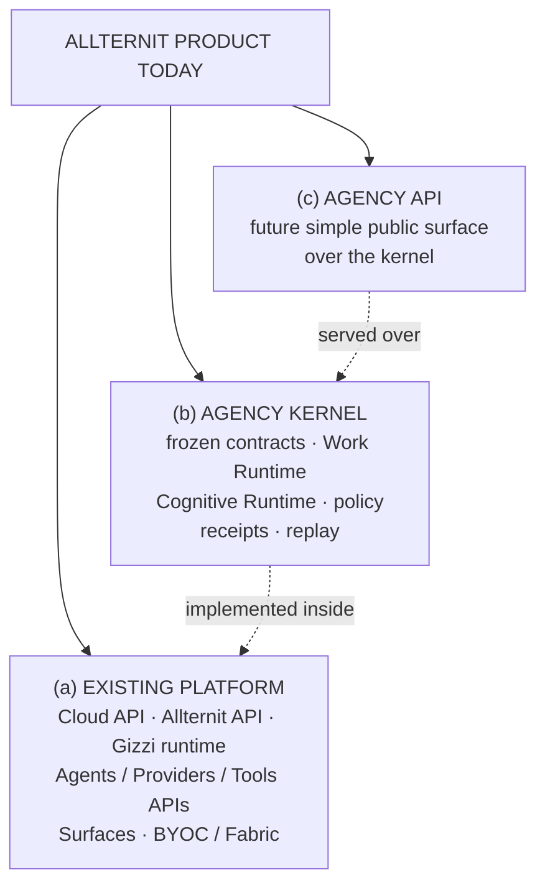
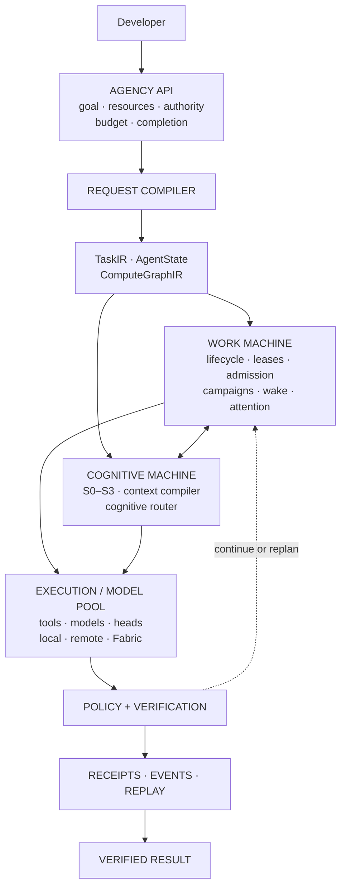
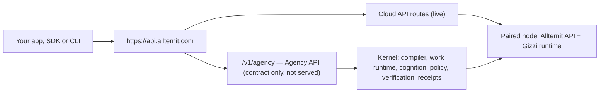
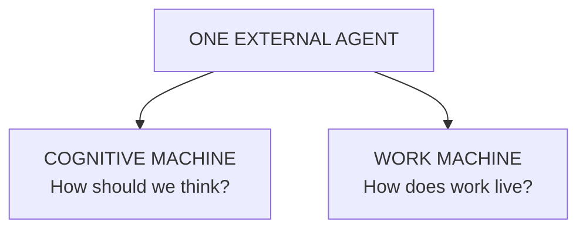

Allternit implements agency as a system. Models do not own the agent. Allternit owns state, work, tools, policy, verification, memory, routing, and execution. Models are interchangeable cognitive components used only where cognition is required.

<Tip>
**Start here.** Four pages give the whole mental model, in this order:
1. **Architecture** (this page): the canonical diagram and who owns what.
2. [**The Two Machines**](/architecture/two-machines): how work lives, and how the system thinks.
3. [**Agency API**](/api/agency/overview): the public surface. Send a goal, get one durable, verified run.
4. [**Contracts, not models**](/architecture/contracts-not-models): why graphs ask for capabilities, never for a named model.

Then read [Why this is different from an agent loop](/architecture/agent-loop).
</Tip>

## Three systems

Allternit today is three systems. Keep them apart when you read these docs.



The Agency Kernel is being implemented inside the existing Allternit platform. Some components are already on the main execution path, some are internal or shadow-only, and others remain design or research. The status shown for each component refers to implementation and exposure separately.

Existing runtime/provider APIs expose implementation controls intentionally. The Agency API is the abstraction that hides those controls behind capabilities and one durable agent identity.

## The canonical diagram

One request, from the developer's call to a verified result:



### Request path

A caller sends a goal with optional resources, authority, budget and completion criteria. The **request compiler** turns it into explicit internal contracts: a typed task (TaskIR), the run's semantic state (AgentState) and an executable work plan (ComputeGraphIR). The **Work Machine** admits and leases each graph node and carries it across time. The **Cognitive Machine** decides how each step is thought through, at the lowest sufficient [cognition level](/architecture/cognition-levels). **Execution** runs a tool, a deterministic backend, a decision head or a model from the pool. Every result passes **policy and verification**, and every effect, input and verdict is written as a **receipt**. The run is durable the whole way through, callers observe it as typed events, and a finished run can be replayed.

Several boxes are not live yet. The Agency API endpoint and the request compiler are not served, and nothing calls the router on the normal path. See [current reality](#current-reality).

<Note>
**About "One Brain, Many Faces".** That was the earlier product metaphor: one runtime behind many surfaces. It still describes the product shape, but it is not the technical explanation, and the "brain" was never a model. The systems architecture is the **Agency Kernel** shown above.
</Note>

## Kernel and Agency API

Two names appear throughout these docs. They are different things:

- **The kernel** is the system that runs agent work: it compiles a goal into typed contracts, carries the run durably, enforces policy, verifies results and writes receipts. See [The kernel](/architecture/kernel).
- **The Agency API** is the public HTTP surface over the kernel: send a goal, get one durable, verified run. Its status is Implementation **DESIGN** (server) · Exposure **PUBLIC PREVIEW** (contract): the [v0.3 contract](/api/agency/overview) is published and the endpoint is not served yet.

There is one public origin, `https://api.allternit.com`. `/v1/agency` is a new surface of the existing [Cloud API](/api/overview), not a separate service.



The detailed path of one request inside the kernel is in [Request path](#request-path).


## Status labels

Status has two axes, because "the code exists" and "you can use it" are different facts. Every architecture page carries both, plus a four-field block: **Architecture** (what the final contract requires) · **Implemented today** (what code exists on main) · **Active path** (whether normal execution uses it: yes / partial / internal / no) · **Public exposure** (whether an external developer can use it).

**Implementation**

| Value | Meaning |
|-------|---------|
| **DESIGN** | Specified. No working code on main. |
| **IMPLEMENTED** | Code and tests on main, but not on by default in the normal path, or nothing calls it yet. |
| **SHADOW** | Runs alongside the real path (or behind an off-by-default flag) and observes; its output changes nothing. |
| **ENABLED** | On main and on by default in the path it belongs to. |
| **RESEARCH** | Being investigated. No committed design. |

**Exposure**

| Value | Meaning |
|-------|---------|
| **—** | Nothing to expose yet. |
| **INTERNAL** | Used inside Allternit only. An external developer cannot reach it. |
| **PUBLIC PREVIEW** | A published contract or opt-in surface for review. It may change, and it may not be served yet. |
| **PUBLIC** | Supported and usable by external developers. For contracts, "PUBLIC (docs)" means published as documentation with no endpoint. |

Optionally, a row adds **Production verified: yes/no**: whether the behavior has been checked on a production deployment, not only in tests.

## The invariant

Allternit does not use a model to simulate an agent. Allternit implements the agent as a system and uses models as interchangeable cognitive components.

In practice this means the parts of an agent that must be dependable are owned by the system, not by a model:

- **State** lives in typed, versioned records, not in a transcript.
- **Authority** comes from explicit, scoped grants checked by policy, not from a prompt.
- **Lifecycle** (start, wait, resume, cancel, finish) is driven by a work runtime, not by a model loop.
- **Completion** is decided by the system from verification evidence, not by a model saying it is done.

There is a test for this. If swapping one model for another changes the agent loop, the state model, tool authority, completion semantics or the workflow graph, the implementation does not conform to the architecture.

<Note>
This page describes both the design and the current state of the build. Each section says which is which, and the [status table](#what-is-live-today) at the end lists what runs today and what does not.
</Note>

## The two machines

The agent is two machines that share a policy layer and a compute fabric. The full page is [The Two Machines](/architecture/two-machines).



The Cognitive Machine decides how cognition is performed. The Work Machine decides how work persists and progresses.

| Machine | What it does | Main parts |
|---------|--------------|------------|
| **Cognitive Machine** | Decides and produces, at the lowest sufficient cognition level. | S0–S3 levels, decision runtime, context compiler, Cognitive Execution Router, model pool |
| **Work Machine** | Makes work durable across time, processes and restarts. | Graph lifecycle, node outputs, leases and heartbeats, admission, wait gates, campaigns, wake, attention |

A model is one component inside the Cognitive Machine. It is not the agent.

## The eight planes

The eight planes are the technical decomposition of the diagram above. Each responsibility has one owner. Per-plane status is on [The eight planes](/architecture/planes).

| # | Plane | Owns | Does not own |
|---|-------|------|--------------|
| 1 | Experience / API | The single external agent identity, the API and SDK surface, event streams, artifacts. The [Agency API](/api/agency/overview) lives here. | Agent logic, lifecycle or decisions. |
| 2 | Agent | TaskIR, AgentState, the agent instruction set, capability semantics. | Execution, or which component serves a capability. |
| 3 | Work Orchestration | The compute graph, node lifecycle, outputs, leases, heartbeat and reclaim, admission, campaigns, wait and wake, idempotency. | How cognition is performed, or authorization. |
| 4 | Cognition | Decisions and bounded reasoning: S0–S3, the decision runtime, the judge runtime. | Permissions, lifecycle or durable state. |
| 5 | Context + State | The context compiler, chunk store, memory, cognitive state. | Node lifecycle (the work runtime ledger owns that) or authority. |
| 6 | Execution / Model | The Cognitive Execution Router, the model pool, tool runtimes, fabric placement. | Eligibility policy or completion. Specific models are implementations behind contracts. |
| 7 | Governance + Observability | Authorization and evidence: policy, receipts, replay, evaluations, provenance, budgets. | Generation. Models may recommend but cannot grant authority. |
| 8 | Product Operations | Attention, human approvals, channels, pause, resume and kill, the needs-you queue, audit views. | A second agent runtime. It presents and routes; it does not decide or execute. |

## Cognition levels S0–S3

Use the lowest sufficient cognitive level. Each graph node is assigned one level; the levels are roles within one agent, not separate agents. The ladder diagram and full rules are on [Cognition levels S0–S3](/architecture/cognition-levels).

| Level | What it is | Examples |
|-------|-----------|----------|
| **S0** | Exact computation | Parser, compiler, policy, tests, graph rules |
| **S1** | Constrained decision | Choose, rank, score, recommend at a gate |
| **S2** | Bounded generation | A patch, a hypothesis, an explanation |
| **S3** | Deep escalation | A larger solver, an ensemble, a request to a human |

## Design laws

| # | Law | Plain meaning |
|---|-----|---------------|
| 1 | No implicit agency | Nothing acts unless an explicit contract (a graph node, a grant) says it may. There is no free-form loop. |
| 2 | State before prose | Truth is typed state. Text a model wrote is not the record. |
| 3 | Select before generate | If the legal answers are known, choose among them instead of generating text. |
| 4 | Candidate, not truth | Model output is a candidate until a verifier passes it. |
| 5 | One external identity | Callers see one logical agent. Which internal components ran is execution evidence, shown only in receipts and debug views. |
| 6 | Contracts, never model names | Contracts name capabilities, classes, locality and trust. No contract names a model or vendor. |
| 7 | Policy outranks probability | A hard policy deny is never overridden by a probabilistic judgment. |
| 8 | Graceful degradation | When a component is missing or slow, the system falls back to a safer path instead of failing open. |
| 9 | Measure system lift | Evaluate the whole system on the task, not a model in isolation. |
| 10 | Hardware independence | The contracts do not assume a particular machine size or accelerator. |

Four further rules follow from these and are covered on their own pages:

- Models cannot own permission, lifecycle, completion, durable truth or policy. See [Policy and safety](/architecture/policy).
- Completion is owned by the verifier and the system. See [Verification](/architecture/verification).
- Effectful retries need idempotency keys and receipts. Run state survives model eviction, cache loss, executor death and process restart. See [Receipts](/architecture/receipts).
- The contracts between all of these parts are frozen and versioned. See [Kernel contracts](/architecture/kernel-contracts).

## How today's pieces map

The Agency Kernel is being implemented inside the existing Allternit platform. These are the existing parts and where they sit in the architecture.

| Piece | Role in the architecture | Docs |
|-------|--------------------------|------|
| **Gizzi Code** | The agent runtime and CLI. It executes work: sessions, tools, sandboxing, model calls. | [Gizzi runtime](/core/gizzi-runtime), [CLI](/cli/overview) |
| **CommRails** | The work runtime (Work Orchestration plane). It carries work as a graph of nodes with outputs, wait gates, leases and campaigns. | [CommRails](/core/commrails) |
| **Permission floor** | The start of the Governance plane. Hard policy runs first. Work-bound executor paths are being converged on the Allternit policy gate; direct interactive runtime behavior may differ from Agency/work-runtime execution. | [Policy and safety](/architecture/policy) |
| **Kernel ABI 1.0.0** | The frozen contract package that every plane is built against. | [Kernel contracts](/architecture/kernel-contracts) |
| **Surfaces** | The Experience plane today: desktop, web, mobile, extensions. | [Desktop](/surfaces/desktop), [Platform](/surfaces/platform) |

### Surfaces

The surfaces are the Experience plane today. They hold no agent logic of their own; the SDK and communication layer connect them to the runtime. See the [TypeScript SDK](/sdk/typescript), [Communication](/core/communication) and [Git DAG](/core/git-dag).

<CardGroup cols={3}>
  <Card title="Desktop App" icon="desktop" href="/surfaces/desktop">
    Packaged Electron app. Loads the platform, manages local VMs and global hotkeys.
  </Card>
  <Card title="Platform" icon="browser" href="/surfaces/platform">
    Web shell for chat, code, workspace, design and Agent Hub.
  </Card>
  <Card title="Extensions" icon="puzzle" href="/surfaces/extensions">
    Browser extension for browser automation, plus Office add-ins.
  </Card>
</CardGroup>

## What is live today

Checked against main on 2026-09-30. Production verified: no, unless a row says so.

| Component | Implementation | Exposure | Notes |
|-----------|----------------|----------|-------|
| Existing platform (Cloud API, Allternit API, Gizzi runtime, surfaces) | **ENABLED** | **PUBLIC** | The product you use today. See [API overview](/api/overview). |
| Kernel ABI 1.0.0 | **IMPLEMENTED** | **PUBLIC** (docs) | Frozen contract package, registry, generated types, schema tests. See [Kernel contracts](/architecture/kernel-contracts). |
| Work runtime: outputs, wait gates, leases and reclaim, campaigns, attention gate | **ENABLED** | **INTERNAL** | Runs inside the internal work runtime. See [Work Machine](/architecture/work-machine). |
| Permission floor | **ENABLED** | **INTERNAL** | Hard policy before probabilistic judgment. See [Policy](/architecture/policy). |
| Policy gate on executor paths | **IMPLEMENTED** (converging) | **INTERNAL** | Work-bound executor paths are being converged on the Allternit policy gate; direct interactive runtime behavior may differ from Agency/work-runtime execution. |
| Fail-closed judge, verifier-owned completion | **IMPLEMENTED** (opt-in) | **INTERNAL** | Opt-in for internal flows; forced on for agency-origin work. See [Verification](/architecture/verification). |
| Decision Runtime (S1) | **SHADOW** | **INTERNAL** | Shadow by default. One primitive (`judge.first_pass.tool`) has passed and acts only through a budgeted canary with live mode on. See [Decision runtime](/architecture/cognitive-runtime/decision-runtime). |
| Cognitive Router | **IMPLEMENTED** | **INTERNAL** | Library code. Nothing calls it on the normal path yet. See [Routing](/architecture/routing). |
| ModelPool | **IMPLEMENTED** | **INTERNAL** | Registry served internally; normal execution does not select through it. |
| Replay: cassettes, recorded-only replay, divergence, `POST /v1/replays` on the work runtime service, gate replay mode | **IMPLEMENTED** | **INTERNAL** | On demand, not part of normal execution. See [Replay](/architecture/replay). |
| Context Compiler, Tool Call Compiler | **SHADOW** | **INTERNAL** | Behind a flag that is off by default. See [Context](/architecture/context). |
| Signed effect receipts and JWKS | **ENABLED** | **INTERNAL** | Keys served by the internal work runtime service, not on `api.allternit.com`. Not every receipt type is on the signed chain. See [Receipts](/architecture/receipts). |
| ExecutionEnvironment: resolution and ledger recording | **ENABLED** | **INTERNAL** | Every work-runtime spawn resolves and records its environment (`inherit_process_env: false` in the document). See [ExecutionEnvironment](/architecture/tools-execution/execution-environment). |
| ExecutionEnvironment: stripping the process env | **IMPLEMENTED** (opt-in) | **INTERNAL** | Only with `ALLTERNIT_EXEC_ENV_ENFORCE=1`; off by default. |
| Egress guard | **ENABLED** (web proxy, design connector import) · **DESIGN** (work-runtime nodes) | **INTERNAL** | Per path. See [Network and SSRF](/architecture/tools-execution/network-ssrf). |
| Typed node lifecycle, graph validator | **IMPLEMENTED** | **INTERNAL** | Library code; not enforced on every graph. |
| Kernel conformance suite | **IMPLEMENTED** | **INTERNAL** | Kernel-layer tests on main. See [Conformance](/architecture/observability/conformance). |
| Agency API conformance, alpha gate | **DESIGN** | **—** | Tests are written; there is no server to run them against. |
| Agency API (`/v1/agency`) | **DESIGN** (server; contract only) | **PUBLIC PREVIEW** | The [v0.3 contract](/api/agency/overview) is published. The endpoint is not served. |
| Request compiler, runtime state store | **DESIGN** | **—** | Contracts only. |
| Cross-model KV / state transfer | **RESEARCH** | **—** | Contracts reserve the shape. See [Routing](/architecture/routing). |

## Current reality

**Implemented foundation**

- Frozen Kernel ABI 1.0.0 with a 191-ID primitive registry.
- The internal work runtime: node outputs, wait gates, leases and reclaim, campaigns, the attention gate.
- The permission floor, on by default.
- Signed, hash-chained effect receipts, with keys served internally.
- Replay: cassettes, recorded-only replay, divergence reports.
- Cognitive Router and ModelPool as internal code; Decision Runtime and both compilers in shadow.
- Per-node ExecutionEnvironment resolution and ledger recording.
- The kernel-layer conformance suite.

**Not yet the full system**

- `/v1/agency` is not live.
- The request compiler path has not reached alpha.
- The conformance gate is incomplete: Agency API conformance and the alpha gate cannot run.
- Not all receipt types are signed.
- Public JWKS is not exposed.
- S1 cannot act.
- The Context Compiler and Tool Call Compiler are shadow.
- Cross-model KV is research.
- Some environment and security enforcement is flag- or path-dependent.
- The default runtime path is not converged on the policy gate.

The Agency API opens for alpha only after one end-to-end run can survive restart, resume, verify, replay and receipt-backed completion. That gate is not met.

## Production topology

This section describes how the product is deployed today. It is independent of the architecture above.

There is **one public API**. The Cloud API is the control plane. Allternit API is the data plane and is never a public hostname.

```
Browser / SDK / CLI  →  https://api.allternit.com  (Cloud API, Postgres)
                              │
                              │ outbound WebSocket relay
                              ▼
                     Allternit API :8013 (SQLite, not public)
                              │
                              ▼
                     Gizzi runtime (local to the node)
```

| Plane | Binary | Origin | Database |
|-------|--------|--------|----------|
| Control | `allternit-cloud-api` | `https://api.allternit.com` | Postgres |
| Data | `allternit-api` | loopback / tailnet `:8013` | Per-instance SQLite |

Node-affine routes (agent sessions, Office, beta research) are Cloud API handlers that **relay** to the caller's default healthy node. No healthy node → HTTP 428.

Full split: [API Overview](/api/overview).

## Deployment models

<AccordionGroup>
  <Accordion title="Local desktop">
    Allternit Desktop runs Allternit API and Gizzi on the user's machine and pairs the node to the account. Best for day-to-day work on a laptop.
  </Accordion>

  <Accordion title="User-paired (BYOC)">
    Install Allternit API on a VPS or homelab you own. Approve a pairing code. The node opens an outbound relay — no inbound ports. Best for data residency and existing infrastructure.
  </Accordion>

  <Accordion title="Allternit-provisioned">
    Cloud API creates an isolated instance per subscription. Init installs Allternit API and auto-pairs. Best for teams that want a hosted data plane without running a box.
  </Accordion>
</AccordionGroup>

See [BYOC Overview](/byoc/overview).

## Next

<CardGroup cols={2}>
  <Card title="The Two Machines" icon="gears" href="/architecture/two-machines">
    How work lives, and how the system thinks.
  </Card>
  <Card title="Contracts, not models" icon="file-signature" href="/architecture/contracts-not-models">
    Graphs request capabilities; the router picks an implementation.
  </Card>
  <Card title="Not an agent loop" icon="arrows-spin" href="/architecture/agent-loop">
    Why a model never decides that work exists, is allowed or is done.
  </Card>
  <Card title="Agents" icon="user-gear" href="/architecture/agents">
    What an agent is: a profile and identity, not a model.
  </Card>
  <Card title="The kernel" icon="microchip" href="/architecture/kernel">
    The durable run, its statuses, attention and budgets.
  </Card>
  <Card title="Policy and safety" icon="shield" href="/architecture/policy">
    The policy floor, authority profiles and the fail-closed judge.
  </Card>
  <Card title="Verification" icon="list-check" href="/architecture/verification">
    Who decides a run is done, and on what evidence.
  </Card>
  <Card title="Receipts" icon="receipt" href="/architecture/receipts">
    What a receipt proves and how a chain is verified.
  </Card>
  <Card title="Replay" icon="rotate-left" href="/architecture/replay">
    Re-running a finished run with recorded effects only.
  </Card>
  <Card title="Kernel contracts" icon="file-contract" href="/architecture/kernel-contracts">
    The frozen ABI 1.0.0 package.
  </Card>
  <Card title="Agency API" icon="code" href="/api/agency/overview">
    The public surface over the kernel (public preview contract, not served).
  </Card>
</CardGroup>

## Related systems

These systems have their own pages and map onto the planes above:

- [Intent Graph Kernel](/core/intent-graph-kernel): the durable graph of intents, tasks, decisions and memories behind UI, context and memory projections (Agent and Context + State planes).
- [Canonical Computer Use](/core/canonical-computer-use): the neutral contract and trust core for computer-use tools (Execution plane, under the same policy floor).
