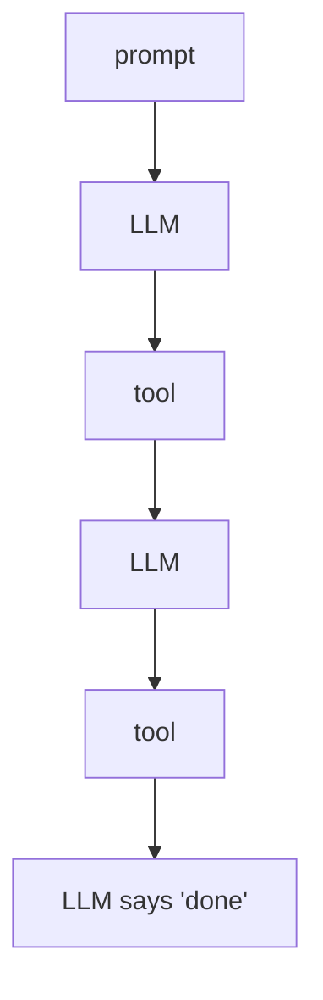
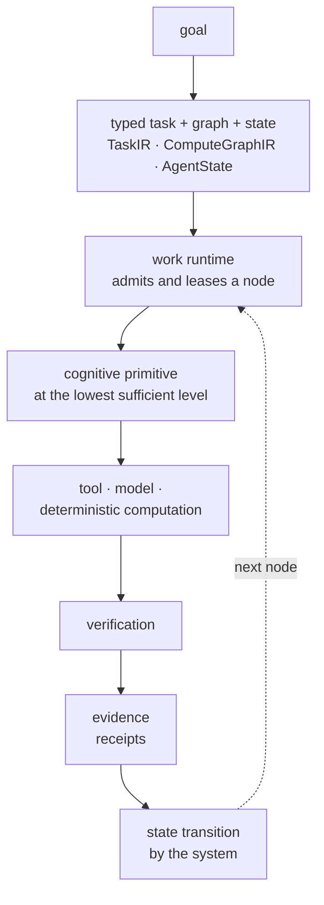

**Status: architecture explainer.** Component status is on [what is live today](/architecture#what-is-live-today).

Most agent frameworks put a model in a loop and let it decide what happens next. Allternit does not.

## A conventional agent loop

The model decides what to do, when to call a tool, what to remember and when the work is finished. The transcript is the state. If the model changes, the agent changes.

## Allternit

Each step is owned by an explicit component, and each hand-off is a typed contract.

**In Allternit, an LLM does not decide that a task exists, that it has permission, that a side effect may run, that work is complete, or that state should persist. Those responsibilities belong to explicit system components.**

| Responsibility | Conventional loop | Allternit |
|----------------|-------------------|-----------|
| A task exists | The model's plan | The request compiler and the compute graph |
| Permission | Whatever the tool wrapper allows | [Policy](/architecture/policy): hard floor first, grants are explicit |
| A side effect may run | The model calls the tool | The gate, with an idempotency key and an effect [receipt](/architecture/receipts) |
| Work is complete | The model says "done" | [Verification](/architecture/verification) and the system |
| State persists | The transcript | Typed, versioned [AgentState](/architecture/state) and the work runtime ledger |
| Which model runs | Hard-coded | The [router](/architecture/contracts-not-models), per capability request |

## Related

- [Living Agent Architecture](/architecture)
- [The Two Machines](/architecture/two-machines)
- [Contracts, not models](/architecture/contracts-not-models)
