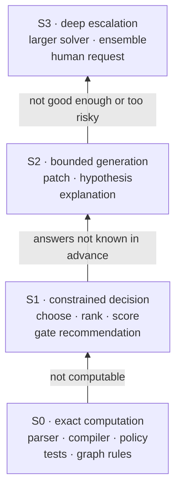

**Status: AVAILABLE (S0) · PREVIEW (S1, shadow only) · AVAILABLE (S2 generation) with PREVIEW candidate enforcement · PREVIEW (policy-routed S3; router not yet called).** See [status labels](/architecture#status-labels).

Each graph node is assigned one cognition level. The levels are roles within one agent, not separate agents, and they are independent of which [execution mode](/architecture/routing) provides them.

## Use the lowest sufficient cognitive level

Start at the bottom. Climb a rung only when the level below cannot answer. Each rung up costs more, is harder to check, and needs more verification before its output counts.

## Architecture contract

| Level | What it is | Output | May not |
|-------|-----------|--------|---------|
| **S0** | Exact deterministic computation, policy checks, tool execution | A typed fact or a receipt | Nothing beyond what its code and grants allow |
| **S1** | A bounded probabilistic decision over known candidates | A decision with a confidence | Own authority, reason free-form, hold durable state or cause side effects. Mint permissions, raise spend, cross a workspace boundary or skip a required verifier. |
| **S2** | Bounded generation | A candidate artifact | Write state directly. Its output is a candidate until verified. |
| **S3** | Deep escalation: a larger solver, an ensemble, a specialist or a human | A candidate or an answer | Be selected by a weaker component judging itself. A human route always goes through an attention request. |

### Choosing a level

Pick the cheapest correct form of inference before picking any component:

1. **Deterministic code**, when the answer can be computed (S0).
2. **Candidate scoring**, when every legal answer is known in advance (S1).
3. **Structured decoding**, when the shape is known but the values are not (S2 with a grammar).
4. **Free generation**, when none of the above fit (S2 or S3).

Every transition records its evidence, state version, capability, confidence and verification status.

### Degradation

When a component is missing or not good enough, the chain is: alternate local component, then a stronger one, then deterministic reconstruction, then a human or an explicit failure. It never fails open.

Why levels: most agent steps do not need generation. Classifying each step lets the system answer "which file", "is this safe", "are we done" with a scored choice or a computation, which is cheaper, faster and checkable, and reserve generation for the steps that need it.

## Current implementation

- **S0**: deterministic policy and tool execution run today through the gate and the permission floor.
- **S1**: the decision runtime is on main and runs in shadow mode by default. It records its answers and abstains. S1 does not act on anything until a primitive passes its [calibration gate](/architecture/cognitive-runtime/calibration), and no primitive has yet.
- **S2**: generation runs today through the agent runtime. The rule that generated output is a candidate is enforced by the verifier for agency-origin work, and by the graph validator where the validator is used.
- **S3**: a human route goes through the attention gate today. The router that selects escalation to a stronger component is on main as library code, but nothing calls it in production yet.

## Availability

| Level | Status |
|-------|--------|
| S0 | **AVAILABLE** |
| S1 | **PREVIEW** (shadow only) |
| S2 generation | **AVAILABLE** |
| S2 candidate-until-verified enforcement | **PREVIEW** (agency-origin work) |
| S3 human route via attention | **AVAILABLE** (internal) |
| S3 policy-routed escalation | **PREVIEW** (router is library code; not called in production) |

## Developer relevance

When you design a primitive, choose its level first. If you can list the legal answers, make it an S1 decision rather than a generation step. If it has side effects, it is S0 behind policy, not S1.

## Related

- [Decision runtime](/architecture/cognitive-runtime/decision-runtime)
- [Abstain and escalate](/architecture/cognitive-runtime/abstain-escalate)
- [Routing](/architecture/routing)
