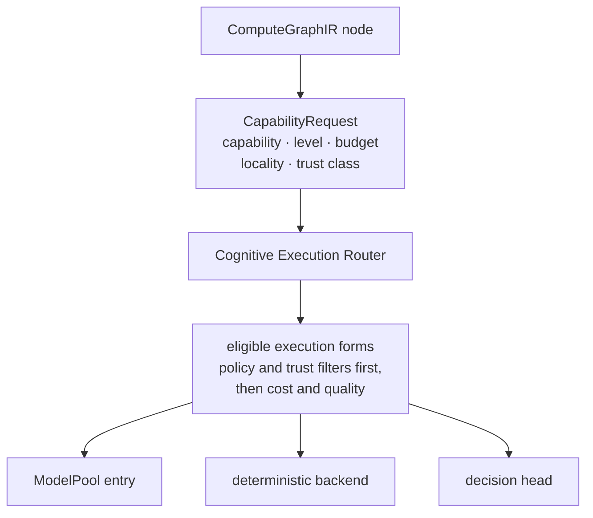

**Status: AVAILABLE (capability contracts, Kernel ABI 1.0.0) · PREVIEW (router and model pool: library code on main, nothing calls the router in production yet).** See [status labels](/architecture#status-labels).

A graph node never says which model to use. It says which **capability** it needs, with its constraints. The system decides what provides it.

```text
Not this:   model = <specific-model>
This:       capability = cap.generate.code_patch
```

## From capability to execution



1. The node carries a **CapabilityRequest**: the capability ID, its cognition level, a budget, and locality and trust constraints.
2. The **Cognitive Execution Router** computes which execution forms are legal for that request. Policy, trust and locality filters run before any scoring, so an ineligible backend is never ranked.
3. Among eligible forms it prefers the cheapest correct one: a deterministic backend before a decision head, a decision head before generation.
4. The chosen implementation runs. Its identity is recorded in the receipt as execution evidence, not written into the graph.

## Implementations are not architecture

Specific models, open-weight decision heads and vendor APIs are implementations behind contracts. They can be added, removed or swapped without changing a graph, the state model, policy or completion semantics. If swapping one of them changes any of those, the implementation does not conform.

This is also why public contracts, graphs and plans never name a model, vendor or tool harness. See [Why no vendor names in graphs](/architecture/cognitive-runtime/no-vendor-names).

## What is live today

| Part | Status |
|------|--------|
| Capability and model pool contracts | **AVAILABLE** (Kernel ABI 1.0.0) |
| Cognitive Execution Router | **PREVIEW** (library on main; nothing calls it in production yet) |
| Model pool registry | **PREVIEW** (served internally by the runtime) |
| S1 decision heads through the router | **PREVIEW** (refused until a calibration manifest passes its gate; shadow by default) |

## Related

- [Routing: the router, the model pool and M0–M6](/architecture/routing)
- [Cognition levels S0–S3](/architecture/cognition-levels)
- [The Two Machines](/architecture/two-machines)
- [Agency API](/api/agency/overview)
