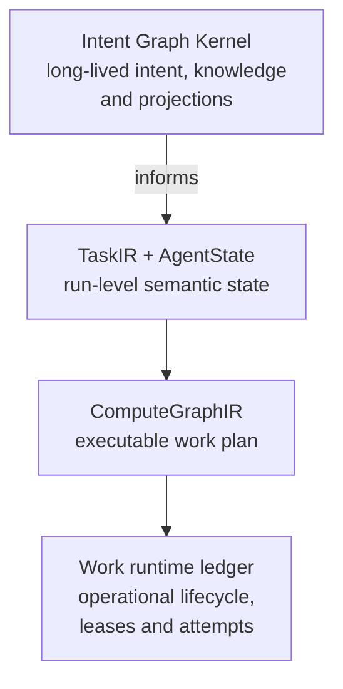

**Implementation: IMPLEMENTED (schemas) · DESIGN (runtime state store) · Exposure: PUBLIC (docs).** See [status labels](/architecture#status-labels).

| | |
|---|---|
| **Architecture** | Run state lives in typed, versioned records, not a transcript. |
| **Implemented today** | AgentState and related schemas in Kernel ABI 1.0.0. No runtime state store. |
| **Active path** | No. |
| **Public exposure** | Documentation only. No endpoint serves it. |

Two records hold what an agent knows and what it was asked to do: **TaskIR**, the compiled form of the request, and **AgentState**, the canonical semantic truth of the run.

## Where each kind of state lives

| Store | Is the store for | Is not the store for |
|-------|------------------|----------------------|
| [Intent Graph Kernel](/core/intent-graph-kernel) | Long-lived intent, knowledge and memory across runs, and the projections built from them | The state of any one run, or where a node is in its lifecycle |
| [TaskIR and AgentState](/architecture/state) | What one run was asked to do, and its canonical semantic truth (facts, hypotheses, artifacts, verification, completion) | Long-lived knowledge, or lease and attempt bookkeeping |
| [ComputeGraphIR](/architecture/graphs) | The executable plan for one run: nodes, edges, capabilities, levels | Whether a node is running right now |
| Work runtime ledger | Operational lifecycle: node status, leases, heartbeats, attempts, outputs, receipts | Semantic truth about the task or long-lived knowledge |

Information flows down. The Intent Graph Kernel informs a run; it does not drive it.

## Architecture contract

### TaskIR

TaskIR is the first decoupling boundary. Whatever the caller wrote, the compiler turns it into one typed task:

| Field | Meaning |
|-------|---------|
| `objective`, `requested_outputs` | What to produce |
| `acceptance_criteria` | What must be true for the task to be complete. Inferred criteria are tagged as inferred. |
| `constraints`, `allowed_scope`, `forbidden_scope` | Where the run may and may not act |
| `risk_class`, `privacy_class` | How careful the run has to be |
| `interaction_mode` | `AUTONOMOUS`, `APPROVAL_GATED` or `RECOMMEND_ONLY` |
| `latency_budget`, `cost_budget` | Limits |
| `completion_policy` | Which completion contract closes the task |

Ambiguity is represented explicitly. Unresolved ambiguity escalates instead of being guessed.

### AgentState

AgentState is the run's truth. It holds identity and `state_version`, the user intent, acceptance criteria, constraints, environment and repository state, the plan and graph cursor, hypotheses kept apart from facts, selected context, generated artifacts, mutation and tool receipts, diagnostics, verification results, unresolved failures, permissions, budgets, subgoals, locks and completion state.

The rules:

- **Canonical state outranks everything.** Transcripts, caches, summaries and model memory are all subordinate to it.
- **Every durable write is versioned.** A write increments `state_version` or records an explicit no-op.
- **Writes are compare-and-swap.** A node reads a snapshot at version N. Its commit succeeds only if state is still at N, and then yields N+1. A stale writer fails with `STATE_CONFLICT`. Last writer wins is not allowed.
- **Hypotheses are not facts.** A guess stays a hypothesis until evidence confirms it.
- **Completion is recorded, never inferred** from the absence of errors.
- **Model changes never change state.** Loading, evicting or losing a model has no effect on AgentState.
- **Model output needs provenance.** Output without a provenance record never becomes durable state.

Why: if the transcript were the record, swapping a model, compressing context or restarting a process would change what the agent believes. Typed, versioned state removes that dependency.

## Current implementation

The AgentState and TaskIR schemas are frozen in [Kernel ABI 1.0.0](/architecture/kernel-contracts) with schema tests. The work runtime today keeps its own durable ledger of graph, node and receipt events, which is the durable record for work. A runtime store that holds AgentState with compare-and-swap commits is not built yet.

## Availability

| Part | Status |
|------|--------|
| `agent_state` and `task_ir` schemas | **AVAILABLE** (contract) |
| Work runtime ledger | **AVAILABLE** (internal) |
| AgentState store with compare-and-swap commits | **DESIGN — NOT YET IMPLEMENTED** |
| Goal-to-TaskIR compiler | **DESIGN — NOT YET IMPLEMENTED** |

## Developer relevance

Components read a projection of AgentState and write typed results. They do not keep their own hidden state between steps. If you build against the contracts now, validate against the schemas in `spec/Contracts/kernel/v1/schemas/`.

## Related

- [Graphs](/architecture/graphs)
- [Context](/architecture/context)
- [Kernel contracts reference](/architecture/kernel-contracts-reference)
