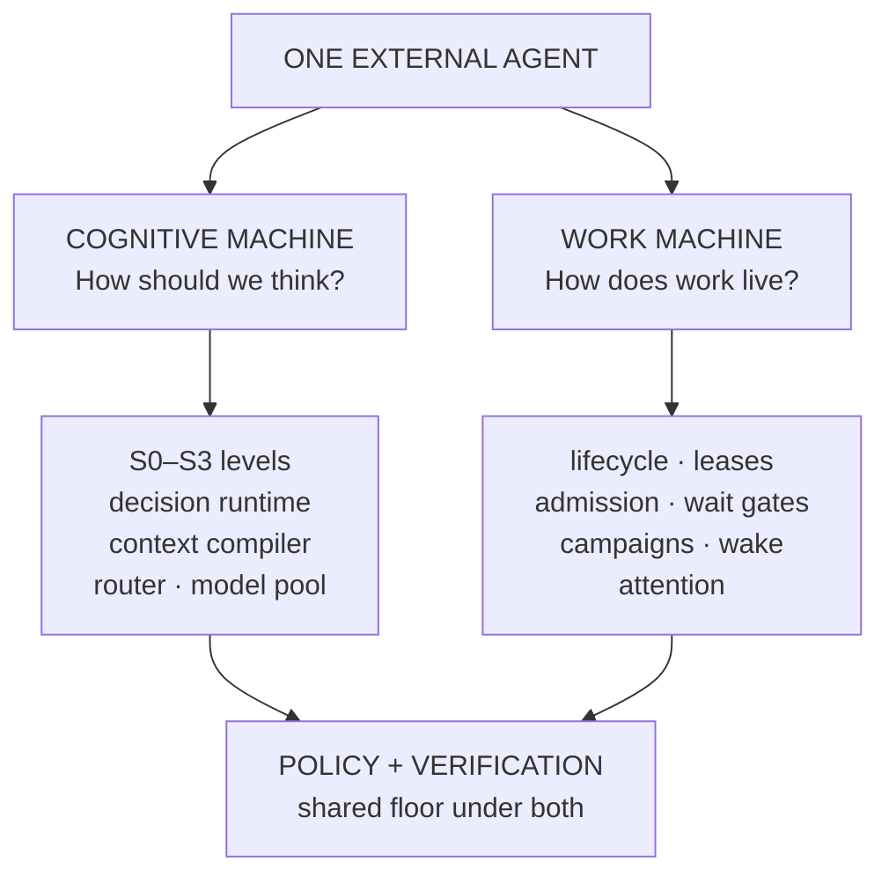

**Status: AVAILABLE (Work Machine, internal work runtime) · PREVIEW (Cognitive Machine: decision runtime, router, compilers, all shadow or library).** See [status labels](/architecture#status-labels).

Callers see one agent. Inside, that agent is two machines with a hard boundary between them.

**The Cognitive Machine decides how cognition is performed. The Work Machine decides how work persists and progresses.**

## The boundary

| Question | Owned by | Never owned by |
|----------|----------|----------------|
| Does this task exist, and what are its nodes? | Work Machine (the compute graph and the work runtime ledger) | A model |
| May this node start now? Who holds it? | Work Machine (admission, leases) | A model |
| Is the run waiting, resumed, cancelled? | Work Machine (lifecycle, wait gates, wake) | A model |
| Should we compute, choose, generate or escalate? | Cognitive Machine (S0–S3, router) | The Work Machine |
| What exact input does a component see? | Cognitive Machine (context compiler) | A transcript |
| Is an action allowed? | Policy, under both machines | Either machine alone, or a model |
| Is the work done? | Verification and the system | A worker or a model |

The two machines talk through typed contracts. The Work Machine hands a node to the Cognitive Machine as a capability request. The Cognitive Machine returns a typed result with evidence. Neither reaches into the other's state.

Why the split: a run has to survive a model being evicted, a process dying and a machine restarting. That only works if lifecycle, leases and waiting live in durable records the system owns. Cognition, on the other hand, should be swappable per step. Keeping the two apart is what makes both properties hold at once.

## Details

- [The Cognitive Machine](/architecture/cognitive-machine): cognition levels, the decision runtime, context, routing.
- [The Work Machine](/architecture/work-machine): lifecycle, leases, admission, wait gates, campaigns, wake and attention.

## Related

- [Living Agent Architecture](/architecture)
- [Contracts, not models](/architecture/contracts-not-models)
- [Why this is different from an agent loop](/architecture/agent-loop)
