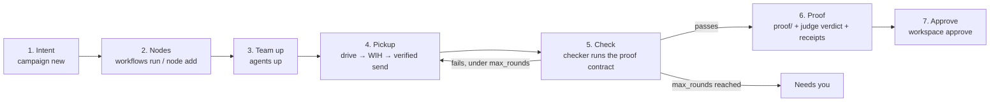

<Note>
Shipping with the Allternit Factory build. The commands on this page are the approved design and are not live yet.
</Note>

A piece of work moves through seven steps. Every step is an event in the ledger, written by the Gate. Every screen (Gizzi, Desktop, your phone) is a view of those events plus live pane state.



## 1. You set intent

```bash
gizzi workspace campaign new "Saved views"
```

This writes the Campaign and the intent in its `SPEC.md`. In Desktop, the same thing happens when you type into Bot Mode's launch screen ("What should the team work on?").

## 2. It's split into nodes

```bash
gizzi workflows run build-check-prove --param feature="Saved views"
# or, one node at a time
gizzi workspace node add
```

Running a [Template](/factory/workflows#templates) or adding nodes creates DAG nodes through the Gate. Each node gets a [folder](/factory/workspace#the-node-folder): `SPEC.md`, `PROGRESS.md`, `PROOF.md` and `proof/`.

## 3. The team boots

```bash
gizzi agents up product-build
```

`agents up` reads [`team.yaml`](/factory/agents#teamyaml). It opens one space with a pane per Terminal bot, each on the harness its preset names, and registers each one. Hosted and Vendor bots on the team are bound, not spawned. Add `--dry-run` to see the plan first.

## 4. Work is picked up

```bash
gizzi workflows drive <dag>
```

`drive` runs in the foreground. It finds nodes that are READY (nothing blocking them) and picks each one up. A pickup is a WIH (work identity handle) through the Gate, and the assigned bot receives the task through a [verified send](/factory/orchestration#delivery-states). A bot can also claim a node itself with `gizzi workspace node claim`.

## 5. It's checked

The checker bot runs the node's [proof contract](/factory/workspace#the-node-folder). If the check fails, the Template's `on_fail` route sends the node back to the builder, up to `max_rounds`. When the limit is reached, the node stops and lands in **Needs you**. It never loops forever.

## 6. It's proven

Evidence lands in the node's `proof/` folder. The judge records a verdict for each contract line (`accomplished`, `not_accomplished` or `needs_human`). Receipts are written when the pickup closes. Progress counts (`proven k/n`) come only from the judge, never from `PROGRESS.md` or a checklist.

## 7. You approve

```bash
gizzi workspace approve <node>
```

You approve from Gizzi, Desktop, a push notification or your own channels. Every surface shows the spec next to the proof. See [Approvals](/factory/approvals).

## Related

- [Workspace](/factory/workspace): campaigns, nodes, proof and the Board
- [Workflows](/factory/workflows): Templates, drive, Wake and gates
- [Determinism contract](/factory/determinism)
