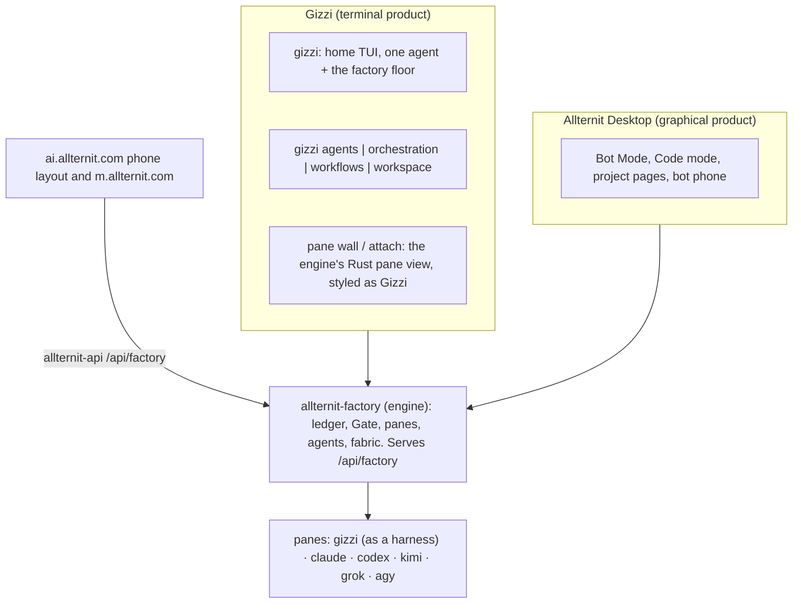

<Note>
Shipping with the Allternit Factory build. This section describes the approved design. Until the build lands, the commands, routes and screens below are not live. Each page says so where it matters.
</Note>

**Allternit Factory** is the harness of harnesses. It runs a team of agents (Gizzi, Claude Code, Codex, Kimi, Grok, agy, hosted bots and vendor bots) against a plan of work, checks the work, and keeps the proof. It's not a second product. It's what **Gizzi** (the terminal product) and **Allternit Desktop** (the graphical product) both run.

You type `gizzi`, or you open Desktop. Underneath sits one engine, `allternit-factory`, which you never type. It installs next to Gizzi and inside Desktop, and every surface reads it.

## Gizzi, the engine and Desktop

- **Gizzi is both a product and a harness.** With no arguments, `gizzi` opens the TUI. Inside a Factory pane, Gizzi is an agent harness like Claude Code or Codex. The same binary does both, so Gizzi dogfoods itself.
- **The engine is one process that outlives any window.** Agents keep running when you close Gizzi. Desktop and your phone read the same engine at the same time. An engine crash doesn't take your terminal with it, which is why the engine is a separate executable.
- **One TUI, two renderers.** Gizzi's TUI draws the home screen, the agents list, the board and approvals. The engine's Rust pane view draws the wall of live terminals. You only ever launch `gizzi`.
- **Windows.** Gizzi runs on Windows, but the pane engine is Unix-only. On Windows, Gizzi drives a Factory running on another machine (a Mac, Linux, or a cloud computer).

### Where the engine comes from

- **Desktop** bundles `allternit-factory` and runs it while Desktop is open. On first run it links `gizzi` (and only `gizzi`) into `~/.local/bin`, if nothing else is there. It also removes the retired `~/.local/bin/allternit-rails`, `ao-*` and `ao-consult` entries, but only after checking each one points at the old tools.
- **The npm package, the Homebrew formula and the runtime packages** install `allternit-factory` next to `gizzi`.
- **Code mode in Desktop** shows Terminal bots as live tiles mirroring their engine panes, with the bot's avatar, `bot@team`, harness and current node. On a phone (ai.allternit.com or the m.allternit.com app), the Code terminal has a strip of Terminal bots to switch between their panes.

## The four parts

The Factory is organized into four parts. Each is a top-level Gizzi command and a section of these docs.

| Part | Command | What it holds |
|---|---|---|
| [Agents](/factory/agents) | `gizzi agents` | The crew: bots, the harness each one runs on, `team.yaml`, presets, machines. Spawn, stop, recover. |
| [Orchestration](/factory/orchestration) | `gizzi orchestration` | Conversation and handoffs: threads (`standing` / `task`), send, capture, transcript, mail, attention, steering, the Coordinator. |
| [Workflows](/factory/workflows) | `gizzi workflows` | Repeatable plans: Templates, drive, Wake, wait-gates, leases. |
| [Workspace](/factory/workspace) | `gizzi workspace` | The work itself: campaigns, plans, DAG nodes, pickups (WIH), node folders, proof, receipts, the judge, the vault, the Board. |

**Why `agents` and not `threads`.** The first part is the crew: which agents exist, which harness each runs on, which machine they're on. A Thread in Allternit is a conversation or an assignment *with* an agent. If the crew part were called `threads`, the word would mean two things. So threads live in `orchestration`.

## What it replaces

The Factory merges two older tools into one engine: the work engine that was called **CommRails** (`allternit-rails`, `rails`) and the agent orchestrator (`ao`). Their names are removed, not aliased. Gizzi's older agent-control commands (`gizzi agent`, `agent-hub`, `runtime`, `mail`, `ac`, `cron`, `cowork`) fold into the four parts, and Desktop's separate orchestrator panel reads the engine. See [Migrating from the old names](/factory/migration).

## Built on rules

Every command follows the [determinism contract](/factory/determinism): only the Gate writes, every screen is a view of the ledger, every mutation has `--dry-run`, every command speaks `--json`, nothing falls back silently, and proof comes from the judge, never from narrative.

## Read next

<CardGroup cols={2}>
  <Card title="How work moves" href="/factory/how-work-moves">
    Intent to approval, step by step.
  </Card>
  <Card title="Command reference" href="/factory/commands">
    Every `gizzi agents|orchestration|workflows|workspace` command.
  </Card>
  <Card title="Architecture" href="/factory/architecture">
    The engine layout, processes, ports and `/api/factory`.
  </Card>
  <Card title="Migrating from the old names" href="/factory/migration">
    Old command and env var to new.
  </Card>
</CardGroup>
