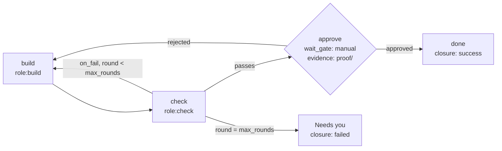

<Note>
Shipping with the Allternit Factory build. The markdown Template format, `drive`, Wake and wait-gates exist in the work runtime today. The `gizzi workflows` commands and the new Template fields (`on_fail`, `max_rounds`, `wait_gate.evidence`, `closure`, `executor: role:`) are the approved design and are not live yet.
</Note>

`gizzi workflows` turns a repeatable plan into nodes and moves them along. A **Template** describes the plan. `run` makes the nodes. `drive` picks up what's ready. **Wake** schedules checks. **Gates** hold a node until something outside happens.

## Templates

A Template is a markdown file: YAML frontmatter with `name` and `description`, any prose you like (it's ignored), and exactly one fenced block tagged `yaml template-spec`.

````markdown
---
name: Build, check, prove
description: build -> check -> (fail: back to build) -> human gate
---

The builder implements the feature. The checker runs the proof contract.
A person approves with the proof in front of them.

```yaml template-spec
params:
  - name: feature            # no default = required
max_rounds: 3                # build/check loops before it stops and asks you
steps:
  - id: build
    title: "Build {{ params.feature }}"
    executor: "role:build"   # bot:<slug> | role:<role> | ao:<harness>
    retry: safe
  - id: check
    title: "Check {{ params.feature }}"
    executor: "role:check"
    blocked_by: [build]
    on_fail: build           # a failed check routes back to this step
  - id: approve
    title: "Approve {{ params.feature }}"
    blocked_by: [check]
    wait_gate:
      kind: manual
      description: "Owner approves with the proof"
      evidence: proof/       # what the gate shows next to the approval
closure:
  success: "Shipped and proven"
  degraded: "Proven with exceptions, see PROOF.md"
  failed: "Stopped at max_rounds, needs you"
```
````

### Step fields

| Field | Required | Meaning |
|---|---|---|
| `id` | yes | Unique within the Template |
| `title` | yes | The node title. `{{ params.<name> }}` is filled in |
| `description` | no | The node's task text. `{{ <step>.output }}` pulls in an earlier step's output |
| `blocked_by` | no | Step ids that must finish first |
| `executor` | no | Who picks it up: `bot:<slug>` (a named bot), `role:<role>` (whichever bot on the team has that role, **new**), or `ao:<harness>` (a harness, kept until the rename sweep) |
| `retry` | no | `safe` means the step is idempotent, so `drive` may restart it after an interruption |
| `on_fail` | no | **New.** The step a failed check routes back to |
| `wait_gate` | no | Holds the node until the gate resolves. `kind`: `manual`, `timer`, `github_run` or `github_pr` |
| `wait_gate.evidence` | no | **New.** The evidence the gate shows when someone resolves it (for example `proof/`) |

### Template fields

| Field | Meaning |
|---|---|
| `params` | Inputs. A param with no `default` is required |
| `max_rounds` | **New.** How many times an `on_fail` loop may run before the node stops and lands in Needs you |
| `closure` | **New.** The closing note recorded for each outcome: `success`, `degraded`, `failed` |

### Validation

A Template is checked before any node exists, so a bad Template leaves no orphan plan. Unknown or duplicate step ids, `blocked_by` cycles, an invalid `executor`, a `{{ <step>.output }}` reference to a step that isn't upstream, unknown `--param` names and missing required params are all refused. Run the check yourself:

```bash
gizzi workflows template check build-check-prove.md
```

### Save a Template

`gizzi workflows template save <file>` runs the same check, then copies the file into this workspace's templates, where `template list`, `workflows run` and the app's Workflows view pick it up. The id is the file name unless you pass `--id`. Saving never replaces a workspace template unless you pass `--force`. A Template saved with a built-in's id (`build-check-prove`, `fact-check`) replaces that built-in in this workspace only.

```bash
gizzi workflows template save release-check.md --dry-run   # what would be saved, and where
gizzi workflows template save release-check.md --id release
```

### Save a run as a Template

When a run worked and you want it again, `gizzi workflows template save --from-run <dag>` turns that run's DAG back into a Template and saves it as `<id>.json`. The plan root's title becomes the Template's name, and the id defaults to that title in lowercase with hyphens (pass `--id` to choose). Every other node becomes a step, in dependency order:

- The `blocked_by` edges between nodes become the steps' `blocked_by`.
- Node ids a Template made (`draft-a1f3`) get their step ids back (`draft`), and `{{ <node>.output }}` references are rewritten to match.
- `retry:safe`, `on_fail` and `max_rounds` labels, wait-gates (with their evidence), and the root's closure texts come back as the Template declared them.
- Executors stay as the nodes carry them (`bot:<slug>` or `ao:<harness>`). Swap in `role:` executors by hand if the Template should work for other teams.
- Param values were already filled in, so they stay as plain text. Add `params` by hand if you want them back.

The result goes through the same check as any Template, and the same `--force` and `--dry-run` rules apply. If some steps of the run hadn't finished, the save still works but prints a note (with `--json`: `fromRun.finished: false`), so look the Template over with `template show` before you use it.

Starting a Template from the app's composer (**Run as**) fills its `role:` steps from your team. With one team in the workspace it's used automatically. With more than one, a **with** picker next to the project picker chooses the team.

In the app, a project's Flow tab has **Save as template** under the run's graph, on Desktop, ai.allternit.com and the phone. It asks for the template name (the run's title by default), saves it, and offers **Replace it** if that name is taken. The saved template shows up in Workflows.

```bash
gizzi workflows template save --from-run dag_7f2c --dry-run
gizzi workflows template save --from-run dag_7f2c --id weekly-release
```

## Build, check, prove



## Run and drive

```bash
gizzi workflows run build-check-prove --param feature="Saved views"
gizzi workflows drive <dag> --dry-run    # what would be picked up, and by whom
gizzi workflows drive <dag>              # do it, in the foreground
gizzi workflows drive <dag> --once       # one pass, then exit
gizzi workflows status <run>
```

`run` turns the Template into DAG nodes through the Gate and prints each step's node id. `drive` finds READY nodes, makes a pickup for each, and sends the task to the assigned bot. It runs in the foreground and stops when you stop it. Nothing runs in the background unless you started it.

## Wake

Wake schedules **checks**, never results. A due wake looks at a node (is the timer up, did the GitHub run finish, is the pane idle) and records what it found. It never marks work done.

```bash
gizzi workflows wake list
gizzi workflows wake due
gizzi workflows wake run
```

This replaces `gizzi cron` for Factory work. See [Wake](/architecture/work-runtime/wake).

## Gates

A wait-gate holds a node until something outside the team happens: a person approves, a timer passes, a GitHub run or PR finishes.

```bash
gizzi workflows gate list
gizzi workflows gate add <node> --kind manual
gizzi workflows gate resolve <gate> approve
```

A manual gate on a node is what puts it in front of you for [approval](/factory/approvals). See [Wait gates](/architecture/work-runtime/wait-gates).

## Related

- [Command reference: `gizzi workflows`](/factory/commands#gizzi-workflows)
- [How work moves](/factory/how-work-moves)
- [Retries](/architecture/work-runtime/retries), [Leases](/architecture/work-runtime/leases)
